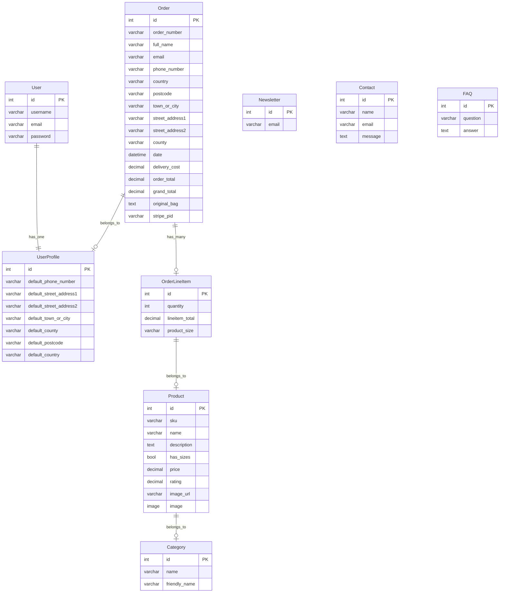

# [PCPartsIreland](https://pcpartsireland-1cfc0205aac1.herokuapp.com)

Developer: Colm Woods ([colmwoods](https://www.github.com/colmwoods))

[](https://www.github.com/colmwoods/PCPartsIreland/commits/main)
[](https://www.github.com/colmwoods/PCPartsIreland/commits/main)
[](https://www.github.com/colmwoods/PCPartsIreland)
[](https://pcpartsireland-1cfc0205aac1.herokuapp.com)

⚠️ PROJECT INTRODUCTION AND RATIONALE⚠️

In this section, include a few paragraphs providing an overview of your project. Essentially, this part is your "sales pitch". Describe what the project hopes to accomplish, who it is intended to target, and how it will be useful to the target audience. Also, assessors lately have been asking that students explain "why" they opted to do a project about this particular topic/subject, so be sure to explain what made you choose this particular theme/concept/subject/idea. This is the project "rationale".

⚠️ --- END --- ⚠️

🛑 README NOTES 🛑

Do not add a **Table of Contents** to your Markdown files. GitHub has these built-in automatically using the headers/hashtags.

Don't add screenshots for the README/TESTING into your `assets` or `static` folders. Create a new folder at the root-level called `documentation`. Consider creating sub-directories within `documentation` to handle things like `wireframes`, `features`, `validation`, `responsiveness`, etc.

Learn about Markdown Alerts (aka Callouts), a fairly new feature for GitHub Markdown files.
https://docs.github.com/en/get-started/writing-on-github/getting-started-with-writing-and-formatting-on-github/basic-writing-and-formatting-syntax#alerts
Note: these are not visible within your README Previewer, and are only visible once you push the code to GitHub.

**Site Mockups**
*([amiresponsive](https://ui.dev/amiresponsive?url=https://pcpartsireland-1cfc0205aac1.herokuapp.com), [techsini](https://techsini.com/multi-mockup), etc.)*
Having issues generating site mockups? This is likely due to security policies with your deployed site.
If you open up your DevTools, there may be an error referencing `X-Frame-Options`.

For Chrome users, head over to http://bit.ly/3iRPn4u and install the extension within your browser. Once installed, navigate back to the mockup site of your choice. You should find your site rendering in the various devices now.

Alternatively, open your project in Gitpod and run the server. Once the site is running, click the `Ports` tab from your Gitpod Terminal. Click the padlock on the appropriate port for your project (`Flask: 5000`, `Django: 8000`). This will make your local page public temporarily. Now, copy the URL of your live-preview page into the responsive tool above. You should find your site rendering in the various devices.

🛑 --- END ---- 🛑


source: [PCPartsIreland amiresponsive](https://ui.dev/amiresponsive?url=https://pcpartsireland-1cfc0205aac1.herokuapp.com)

> [!IMPORTANT]  
> The examples in these templates are strongly influenced by the Code Institute walkthrough project called "Boutique Ado".

## UX

### The 5 Planes of UX

⚠️ NOTE: make sure to update the text below to match your own project! ⚠️

#### 1. Strategy

**Purpose**
- Provide a seamless and intuitive e-commerce experience for customers to browse, filter, and purchase products.
- Empower site owners to manage the store's inventory and customer orders efficiently.

**Primary User Needs**
- Guest users need to browse products and checkout with ease.
- Registered customers need a streamlined shopping experience with account and order history features.
- Site owners need robust tools for inventory and order management.

**Business Goals**
- Drive sales by providing a user-friendly shopping experience.
- Build customer loyalty through personalized and efficient account features.
- Maintain an organized and up-to-date store inventory.

#### 2. Scope

**[Features](#features)** (see below)

**Content Requirements**
- Product details, including name, price, description, category, and images.
- Clear prompts and instructions for browsing, filtering, and purchasing.
- Order details, confirmation pages, and email notifications.
- Secure payment processing using Stripe.
- Payment success emails sent to users.
- 404 page for lost users.

#### 3. Structure

**Information Architecture**
- **Navigation Menu**:
  - Links to Home, Products, Cart, Newsletter, and Account sections.
- **Hierarchy**:
  - Prominent product categories and filters for easy navigation.
  - Cart and checkout options displayed prominently for convenience.

**User Flow**
1. Guest user browses the store → filters and sorts products by category, price, or name.
2. Guest user adds items to the cart → proceeds to checkout.
3. Guest user creates an account or logs in during checkout → completes purchase.
4. Returning customers log in → view past orders and track purchase history.
5. Site owners manage inventory → add, update, or delete products and categories.
6. Users signup to the newsletter → potentially receive advanced notice of upcoming sales.

#### 4. Skeleton

**[Wireframes](#wireframes)** (see below)

#### 5. Surface

**Visual Design Elements**
- **[Colours](#colour-scheme)** (see below)
- **[Typography](#typography)** (see below)

### Colour Scheme

⚠️INSTRUCTIONS ⚠️

Explain your colors and color scheme. Consider adding a link and screenshot for your color scheme using [coolors](https://coolors.co/generate).

When you add a color to the palette, the URL is dynamically updated, making it easier for you to return back to your color palette later if needed. See example below:

⚠️ --- END --- ⚠️

I used [coolors.co](https://coolors.co/080708-3772ff-df2935-fdca40-e6e8e6) to generate my color palette.

- `#000000` primary text.
- `#3772FF` primary highlights.
- `#DF2935` secondary text.
- `#FDCA40` secondary highlights.


### Typography

⚠️ INSTRUCTIONS ⚠️

Explain any fonts and icon libraries used, like **Google Fonts**, **Font Awesome**, etc. Consider adding a link to each font used, the Font Awesome site (if used), or similar icon library.

⚠️ --- END --- ⚠️

- [Montserrat](https://fonts.google.com/specimen/Montserrat) was used for the primary headers and titles.
- [Lato](https://fonts.google.com/specimen/Lato) was used for all other secondary text.
- [Font Awesome](https://fontawesome.com) icons were used throughout the site, such as the social media icons in the footer.

## Wireframes

⚠️ INSTRUCTIONS ⚠️

If you've created wireframes or mock-ups, use this section to display screenshots of your wireframes. The example table below uses sample pages from the walkthrough project to give you some inspiration for your own project, so please adjust accordingly.

⚠️ --- END --- ⚠️

To follow best practice, wireframes were developed for mobile, tablet, and desktop sizes.
I've used [Balsamiq](https://balsamiq.com/wireframes) to design my site wireframes.

| Page | Mobile | Tablet | Desktop |
| --- | --- | --- | --- |
| Register |  |  |  |
| Login |  |  |  |
| Profile |  |  |  |
| Home |  |  |  |
| Products |  |  |  |
| Product Details |  |  |  |
| Bag |  |  |  |
| Checkout |  |  |  |
| Checkout Success |  |  |  |
| Add Product |  |  |  |
| Edit Product |  |  |  |
| Newsletter |  |  |  |
| Contact |  |  |  |
| 404 |  |  |  |

## User Stories

⚠️ INSTRUCTIONS ⚠️

In this section, list all of your possible user stories for the project. Samples have been provided below using the example walkthrough project for your inspiration. Make sure to adjust to match your own project features!

⚠️ --- END --- ⚠️

| Target | Expectation | Outcome |
| --- | --- | --- |
| As a guest user | I would like to browse products without needing to register | so that I can shop freely before deciding to create an account. |
| As a guest user | I would like to be prompted to create an account or log in at checkout | so that I can complete my purchase and track my order history. |
| As a user | I would like to sign up to the site's newsletter | so that I can stay up to date with any upcoming sales or promotions. |
| As a customer | I would like to browse various product categories (clothing, toys, jewelry, kitchen gadgets, etc.) | so that I can easily find what I'm looking for. |
| As a customer | I would like to sort products by price (low-to-high/high-to-low) and name (alphabetical) | so that I can quickly organize items in a way that suits my shopping style. |
| As a customer | I would like to filter products by category | so that I can narrow down the products to the types I am most interested in. |
| As a customer | I would like to click on individual products to view more details (description, price, image, etc.) | so that I can make an informed decision about my purchase. |
| As a customer | I would like to add items to my shopping cart using quantity increment/decrement buttons | so that I can adjust how many units of a product I want before checkout. |
| As a customer | I would like to view and manage my shopping cart | so that I can review, add, or remove items before proceeding to checkout. |
| As a customer | I would like to adjust the quantity of items in my cart | so that I can modify my purchase preferences without leaving the cart. |
| As a customer | I would like to remove items from my cart | so that I can remove products I no longer wish to buy. |
| As a customer | I would like to proceed to checkout where I see my cart items, grand total, and input my name, email, shipping address, and card details | so that I can complete my purchase. |
| As a customer | I would like to receive a confirmation email after my purchase | so that I can have a record of my transaction and order details. |
| As a customer | I would like to see an order confirmation page with a checkout order number after completing my purchase | so that I know my order has been successfully placed. |
| As a customer | I would like to securely enter my card details using Stripe at checkout | so that I can feel confident my payment information is protected. |
| As a returning customer | I would like to be able to log in and view my past orders | so that I can track my previous purchases and order history. |
| As a returning customer | I would like the checkout process to remember my shipping address | so that future purchases are quicker and easier. |
| As a site owner | I would like to create new products with a name, description, price, images, and category | so that I can add additional items to the store inventory. |
| As a site owner | I would like to update product details (name, price, description, image, category) at any time | so that I can keep my product listings accurate and up to date. |
| As a site owner | I would like to delete products that are no longer available or relevant | so that I can maintain a clean and accurate inventory. |
| As a site owner | I would like to view all orders placed on the website | so that I can track and manage customer purchases. |
| As a site owner | I would like to manage product categories | so that I can ensure items are correctly organized and easy for customers to find. |
| As a user | I would like to see a 404 error page if I get lost | so that it's obvious that I've stumbled upon a page that doesn't exist. |

## Features

⚠️ INSTRUCTIONS ⚠️

In this section, you should go over the different parts of your project, and describe each feature. You should explain what value each of the features provides for the user, focusing on your target audience, what they want to achieve, and how your project can help them achieve these things.

**IMPORTANT**: Remember to always include a screenshot of each individual feature!

⚠️ --- END --- ⚠️

### Existing Features

| Feature | Notes | Screenshot |
| --- | --- | --- |
| Register | Authentication is handled by allauth, allowing users to register accounts. |  |
| Login | Authentication is handled by allauth, allowing users to log in to their existing accounts. |  |
| Logout | Authentication is handled by allauth, allowing users to log out of their accounts. |  |
| Product List | Users can browse all available products with sorting, filtering by categories, and search functionality. |  |
| Product Details | Displays detailed information about a selected product, including its name, description, price, an image, and available sizes. |  |
| Add to Bag | Users can add items to their shopping bag, with support for selecting different sizes if applicable. |  |
| View Bag | Users can view the contents of their shopping bag, adjust quantities, or remove items. |  |
| Checkout | Users can proceed to checkout, where they provide their delivery details and payment information using Stripe integration. |  |
| Order Confirmation | Users receive an on-screen and email confirmation with details of their purchase. |  |
| Profile Management | Users can manage their profile information, including their default delivery address and order history. |  |
| Order History | Users can view their past orders and access details of each order, including products purchased and the delivery status. |  |
| Product Management | Superusers can add, edit, and delete products from the site via a CRUD interface. |  |
| Newsletter | Users can register their email address to receive newsletters from the site. Currently, this only stores the email in the database. |  |
| Contact | Users can submit a message via the contact form, which stores their name, email, and message in the database. |  |
| FAQs | Admins can manage frequently asked questions, which are displayed on the site for users. |  |
| User Feedback | Clear and concise Django messages are used to provide feedback to users when interacting with various features (e.g., adding products to the bag, checking out, etc.). |  |
| Heroku Deployment | The site is deployed to Heroku, making it accessible online for users. |  |
| SEO | SEO optimization with a sitemap.xml, robots.txt, and appropriate meta tags to improve search engine visibility. |  |
| Marketing | Social media presence is available in the footer using external links, as well as a Facebook Marketplace wireframe in the README for future integrations. |  |
| 404 | The 404 error page will indicate when a user has navigated to a page that doesn't exist, replacing the default Heroku 404 page with one that ties into the site's look and feel. |  |

### Future Features

⚠️ INSTRUCTIONS ⚠️

Do you have additional ideas that you'd like to include on your project in the future? Fantastic, list them here! It's always great to have plans for future improvements. Consider adding any helpful links or notes to help remind you in the future, if you revisit the project in a couple years.

A few examples are listed below to align with possible ways to improve on the sample walkthrough project, to give you some inspiration.

⚠️ --- END ---⚠️

- **Product Reviews & Ratings**: Allow customers to leave reviews and rate products, with admin moderation. Display average ratings and review counts on product pages.
- **Wishlist Functionality**: Enable users to save products to a personal wishlist for future purchases. Notify users if wishlist items go on sale or are back in stock.
- **Product Recommendations**: Implement a "Customers who bought this also bought" or "You might also like" feature to suggest related products.
- **Live Chat Support**: Provide real-time customer support through an integrated live chat or chatbot.
- **Abandoned Cart Recovery**: Automatically send emails to users who add items to their cart but don't complete the purchase, offering discounts or reminders.
- **Discount Codes and Vouchers**: Allow the admin to create discount codes or vouchers for promotions and marketing campaigns.
- **Loyalty Program**: Introduce a points-based loyalty system where customers earn points for purchases, which can be redeemed for discounts.
- **Product Inventory Alerts**: Notify customers when out-of-stock items are back in stock, or when low inventory is approaching.
- **Multi-Currency and Multi-Language Support**: Expand the application to support multiple currencies and languages to reach a global audience.
- **Product Bundles**: Offer discounted product bundles (e.g., buy 3 for the price of 2) or custom product kits.
- **Social Media Integration**: Enable users to share products directly to social media platforms or implement a social login for quick account creation.
- **Shipping Tracking Integration**: Provide real-time shipping updates and tracking information directly within the user’s order history.
- **Advanced Analytics Dashboard for Admin**: Offer an in-depth dashboard that displays sales trends, popular products, customer behavior, and more.
- **Subscription-Based Products**: Allow users to subscribe to certain products (e.g., monthly deliveries of consumables like coffee or skincare products).
- **Product Video Demos**: Support product videos to better showcase features, especially for high-tech or complex items.
- **Mobile App**: Develop a mobile app for iOS and Android, providing users with a more optimized shopping experience on mobile devices.

## Tools & Technologies

| Tool / Tech | Use |
| --- | --- |
| [](https://markdown.2bn.dev) | Generate README and TESTING templates. |
| [](https://git-scm.com) | Version control. (`git add`, `git commit`, `git push`) |
| [](https://github.com) | Secure online code storage. |
| [](https://code.visualstudio.com) | Local IDE for development. |
| [](https://en.wikipedia.org/wiki/HTML) | Main site content and layout. |
| [](https://en.wikipedia.org/wiki/CSS) | Design and layout. |
| [](https://www.javascript.com) | User interaction on the site. |
| [](https://www.python.org) | Back-end programming language. |
| [](https://www.heroku.com) | Hosting the deployed back-end site. |
| [](https://getbootstrap.com) | Front-end CSS framework for modern responsiveness and pre-built components. |
| [](https://www.djangoproject.com) | Python framework for the site. |
| [](https://www.postgresql.org) | Relational database management. |
| [](https://whitenoise.readthedocs.io) | Serving static files with Heroku. |
| [](https://stripe.com) | Online secure payments of e-commerce products/services. |
| [](https://mail.google.com) | Sending emails in my application. |
| [](https://mailchimp.com) | Sending newsletter subscriptions. |
| [](https://aws.amazon.com/s3) | Online static file storage. |
| [](https://www.figma.com) | Creating wireframes. |
| [](https://fontawesome.com) | Icons. |
| [](https://chat.openai.com) | Help debug, troubleshoot, and explain things. |
| [](https://mermaid.live) | Generate an interactive diagram for the data/schema. |
| [](https://www.w3schools.com) | Tutorials/Reference Guide |
| [](https://stackoverflow.com) | Troubleshooting and Debugging |

⚠️ NOTE ⚠️

Want to add more?

- Tutorial: https://shields.io/badges/static-badge
- Icons/Logos: https://simpleicons.org
  - FYI: not all logos are available to use

🛑 --- END --- 🛑

## Database Design

### Data Model

Entity Relationship Diagrams (ERD) help to visualize database architecture before creating models. Understanding the relationships between different tables can save time later in the project.


⚠️ INSTRUCTIONS ⚠️

Using your defined models, create an ERD with the relationships identified. A couple of recommendations for building your own free ERDs:
- [Lucidchart](https://www.lucidchart.com/pages/ER-diagram-symbols-and-meaning)
- [Draw.io](https://draw.io)

Looking for an interactive version of your ERD? Consider using a [`Mermaid flowchart`](https://mermaid.live). To simplify the process, you can ask ChatGPT (or similar) the following prompt:

> ChatGPT Prompt:  
> "Generate a Markdown syntax Mermaid ERD using my Django models"  
> [paste-your-django-models-into-ChatGPT]

The "Boutique Ado" sample ERD in Markdown syntax using Mermaid can be seen below as an example.

**NOTE**: A Markdown Preview tool doesn't show the interactive ERD; you must first commit/push the code to your GitHub repository in order to see it live in action.

⚠️ --- END --- ⚠️

I have used `Mermaid` to generate an interactive ERD of my project.



source: [Mermaid](https://mermaid.live/edit#pako:eNqVVcFu2zAM_RVD57RIHLdpfRs6DBg2bB2GXYYAhmIxjlBZcimqqdvk3yfbSVPHceP5kBh8TyRFPtKvLDUCWMwAP0ueIc_nOvDPHwsYvDbv1SM1BVIE998OpieO6Ypj4DxV8xy6CORcqq654NauDYoG2c71IeQ9mqVUMDCygCV3ipJiZTQk2uULwH6WJQSghAuBYO1kKDHsJ5JZ68Rgkkoq-1mpcfojvDCWqiac8YDliXoFm83FxWbTql0crLhNfEX2xDtOkBksB1b1dC-XKEELVSYH-C0TH1m4lAb6tw_uXFCCZ_K3tynKgqTRB2RhjKrvZ-UL2INdQCpzroICZQpdM3KSOuuG9WAGicN3Kq1NzW_PNauam82hrHGwAGV0Zr0g9tyfKAYPkKm4vfJdOqWS_5uvD8ehJabWsV4dfqzzs3N1dp6OJ0T4ypLMoX7pNlOAkk-ApZ8LS124KScZ4qoL-g2nxTFYy82gzKTmKlnw7OQdZAFJIY-3Vt3o71LDV4L8TMMr06Pjmlp13KemvBPpnRxn99afRn618k8lsddlO6NmG-Rcl6fy3R3ZK7tfyTtie890yT9gbRUQDdb-Owm_3ebOaOKD18mg0ag7nHv1daf6y6dfAyM9OrDtbVS75dqu94O2ZSOWA_rgwn9Ta7dzRivwKbLYvwqOD3M21xWPOzK_S52ymNDBiLmikvvuK8ziJVfWWwuuWfzKnlk8jSaXN9ez8HoyHc_C8TiajVjJ4ovp5XUUTqMovLqdXd2Et-FsO2Ivxngfk8vxZBpGkT_m_zxW-_tbY01QNC5b7YJt_wE0ZoQj)

⚠️ RECOMMENDED ⚠️

Alternatively, or in addition to, a more comprehensive ERD can be auto-generated once you're at the end of your development stages, just before you submit. Follow the steps below to obtain a thorough ERD that you can include. Feel free to leave the steps below in the README for future use to yourself.

⚠️ --- END --- ⚠️

I have used `pygraphviz` and `django-extensions` to auto-generate an ERD.

The steps taken were as follows:
- In the terminal: `sudo apt update`
- then: `sudo apt-get install python3-dev graphviz libgraphviz-dev pkg-config`
- then type `Y` to proceed
- then: `pip3 install django-extensions pygraphviz`
- in my `settings.py` file, I added the following to my `INSTALLED_APPS`:
```python
INSTALLED_APPS = [
    ...
    'django_extensions',
    ...
]
```
- back in the terminal: `python3 manage.py graph_models -a -o erd.png`
- drag the new `erd.png` file into my `documentation/` folder
- removed `'django_extensions',` from my `INSTALLED_APPS`
- finally, in the terminal: `pip3 uninstall django-extensions pygraphviz -y`


source: [medium.com](https://medium.com/@yathomasi1/1-using-django-extensions-to-visualize-the-database-diagram-in-django-application-c5fa7e710e16)

## Agile Development Process

### GitHub Projects

⚠️ TIP ⚠️

Consider adding screenshots of your Projects Board(s), Issues (open and closed), and Milestone tasks.

⚠️ --- END ---⚠️

[GitHub Projects](https://www.github.com/colmwoods/PCPartsIreland/projects) served as an Agile tool for this project. Through it, EPICs, User Stories, issues/bugs, and Milestone tasks were planned, then subsequently tracked on a regular basis using the Kanban project board.


### GitHub Issues

[GitHub Issues](https://www.github.com/colmwoods/PCPartsIreland/issues) served as an another Agile tool. There, I managed my User Stories and Milestone tasks, and tracked any issues/bugs.

| Link | Screenshot |
| --- | --- |
| [](https://www.github.com/colmwoods/PCPartsIreland/issues?q=is%3Aissue%20is%3Aopen%20-label%3Abug) |  |
| [](https://www.github.com/colmwoods/PCPartsIreland/issues?q=is%3Aissue%20is%3Aclosed%20-label%3Abug) |  |

### MoSCoW Prioritization

I've decomposed my Epics into User Stories for prioritizing and implementing them. Using this approach, I was able to apply "MoSCoW" prioritization and labels to my User Stories within the Issues tab.

- **Must Have**: guaranteed to be delivered - required to Pass the project (*max ~60% of stories*)
- **Should Have**: adds significant value, but not vital (*~20% of stories*)
- **Could Have**: has small impact if left out (*the rest ~20% of stories*)
- **Won't Have**: not a priority for this iteration - future features

## Ecommerce Business Model

⚠️ INSTRUCTIONS ⚠️

Use this space to discuss the business model for your e-commerce project. An example is provided below that aligns closely with **Boutique Ado's B2C** strategy. Be sure to align to your own project requirements.

⚠️ --- END --- ⚠️

This site sells goods to individual customers, and therefore follows a **Business to Customer** model. It is of the simplest **B2C** forms, as it focuses on individual transactions, and doesn't need anything such as monthly/annual subscriptions.

It is still in its early development stages, although it already has a newsletter, and links for social media marketing.

Social media can potentially build a community of users around the business, and boost site visitor numbers, especially when using larger platforms such a Facebook.

A newsletter list can be used by the business to send regular messages to site users. For example, what items are on special offer, new items in stock, updates to business hours, notifications of events, and much more!

## SEO & Marketing

### Keywords

I've identified some appropriate keywords to align with my site, that should help users when searching online to find my page easily from a search engine. This included a series of the following keyword types:

- Short-tail (head terms) keywords
- Long-tail keywords

I've also played around with [Word Tracker](https://www.wordtracker.com) a bit to check the frequency of some of my site's primary keywords (only until the free trial expired).

### Sitemap

I've used [XML-Sitemaps](https://www.xml-sitemaps.com) to generate a sitemap.xml file. This was generated using my deployed site URL: https://pcpartsireland-1cfc0205aac1.herokuapp.com

After it finished crawling the entire site, it created a [sitemap.xml](sitemap.xml), which I've downloaded and included in the repository.

### Robots

I've created the [robots.txt](robots.txt) file at the root-level. Inside, I've included the default settings:

```txt
User-agent: *
Disallow:
Sitemap: https://pcpartsireland-1cfc0205aac1.herokuapp.com/sitemap.xml
```

Further links for future implementation:
- [Google search console](https://search.google.com/search-console)
- [Creating and submitting a sitemap](https://developers.google.com/search/docs/advanced/sitemaps/build-sitemap)
- [Managing your sitemaps and using sitemaps reports](https://support.google.com/webmasters/answer/7451001)
- [Testing the robots.txt file](https://support.google.com/webmasters/answer/6062598)

### Social Media Marketing

Creating a strong social base (with participation) and linking that to the business site can help drive sales. Using more popular providers with a wider user base, such as Facebook, typically maximizes site views.

I've created a mockup Facebook business account using the [Balsamiq template](https://code-institute-org.github.io/5P-Assessments-Handbook/files/Facebook_Mockups.zip) provided by Code Institute.


### Newsletter Marketing

I have incorporated a newsletter sign-up form on my application, to allow users to supply their email address if they are interested in learning more. 

⚠️ OPTION 1: RECOMMENDED ⚠️

**Custom Django Model Newsletter**

- Create a custom `newsletter` app in your project, with a custom model/class called `Newsletter`.
- This method satisfies two assessment criteria:
    1. include a newsletter
    2. one of your 3 required custom models
- It doesn't need anything except the `email` field on the model, but feel free to add more if you need.
- Example: (keep this in your README if you've done this method, attach your `Newsletter` model in a code block like the following example)
    ```python
    class Newsletter(models.Model):
        email = models.EmailField(unique=True, null=False, blank=False)

        def __str__(self):
            return self.email
    ```
- Consider using the same `send_mail()` functionality used on the `webhook_handler.py` file.
    - You can trigger an email to be sent out to subscribed users when new products are added to the site!

⚠️ --- END --- ⚠️

🛑 OPTION 2 🛑

**MailChimp Newsletter**

- Sign up for a Mailchimp account
- This allows up to 2,500 subscription email sends per month
- Incorporate the code and scripts into your project like in the Code Institute lessons.

🛑 --- END --- 🛑

## Testing

> [!NOTE]  
> For all testing, please refer to the [TESTING.md](TESTING.md) file.

## Deployment

The live deployed application can be found deployed on [Heroku](https://pcpartsireland-1cfc0205aac1.herokuapp.com).

### Heroku Deployment

This project uses [Heroku](https://www.heroku.com), a platform as a service (PaaS) that enables developers to build, run, and operate applications entirely in the cloud.

Deployment steps are as follows, after account setup:

- Select **New** in the top-right corner of your Heroku Dashboard, and select **Create new app** from the dropdown menu.
- Your app name must be unique, and then choose a region closest to you (EU or USA), then finally, click **Create App**.
- From the new app **Settings**, click **Reveal Config Vars**, and set your environment variables to match your private `env.py` file.

> [!IMPORTANT]  
> This is a sample only; you would replace the values with your own if cloning/forking my repository.

🛑 !!! ATTENTION colmwoods !!! 🛑

⚠️ DO NOT update the environment variables to your own! These should never be public; only use the demo values below! ⚠️
⚠️ Replace the keys below with your own actual keys used; example: if not using AWS, then replace those keys with Cloudinary keys, or similar. ⚠️

🛑 --- END --- 🛑

| Key | Value |
| --- | --- |
| `AWS_ACCESS_KEY_ID` | user-inserts-own-aws-access-key-id |
| `AWS_SECRET_ACCESS_KEY` | user-inserts-own-aws-secret-access-key |
| `DATABASE_URL` | user-inserts-own-postgres-database-url |
| `DISABLE_COLLECTSTATIC` | 1 (*this is temporary, and can be removed for the final deployment*) |
| `EMAIL_HOST_PASS` | user-inserts-own-gmail-api-key |
| `EMAIL_HOST_USER` | user-inserts-own-gmail-email-address |
| `SECRET_KEY` | any-random-secret-key |
| `STRIPE_PUBLIC_KEY` | user-inserts-own-stripe-public-key |
| `STRIPE_SECRET_KEY` | user-inserts-own-stripe-secret-key |
| `STRIPE_WH_SECRET` | user-inserts-own-stripe-webhook-secret |
| `USE_AWS` | True |

Heroku needs some additional files in order to deploy properly.

- [requirements.txt](requirements.txt)
- [Procfile](Procfile)
- [.python-version](.python-version)

You can install this project's **[requirements.txt](requirements.txt)** (*where applicable*) using:

- `pip3 install -r requirements.txt`

If you have your own packages that have been installed, then the requirements file needs updated using:

- `pip3 freeze --local > requirements.txt`

The **[Procfile](Procfile)** can be created with the following command:

- `echo web: gunicorn app_name.wsgi > Procfile`
- *replace `app_name` with the name of your primary Django app name; the folder where `settings.py` is located*

The **[.python-version](.python-version)** file tells Heroku the specific version of Python to use when running your application.

- `3.12` (or similar)

For Heroku deployment, follow these steps to connect your own GitHub repository to the newly created app:

Either (*recommended*):

- Select **Automatic Deployment** from the Heroku app.

Or:

- In the Terminal/CLI, connect to Heroku using this command: `heroku login -i`
- Set the remote for Heroku: `heroku git:remote -a app_name` (*replace `app_name` with your app name*)
- After performing the standard Git `add`, `commit`, and `push` to GitHub, you can now type:
	- `git push heroku main`

The project should now be connected and deployed to Heroku!

### PostgreSQL

This project uses a [Code Institute PostgreSQL Database](https://dbs.ci-dbs.net) for the Relational Database with Django.

> [!CAUTION]
> - PostgreSQL databases by Code Institute are only available to CI Students.
> - You must acquire your own PostgreSQL database through some other method if you plan to clone/fork this repository.
> - Code Institute students are allowed a maximum of 8 databases.
> - Databases are subject to deletion after 18 months.

To obtain my own Postgres Database from Code Institute, I followed these steps:

- Submitted my email address to the CI PostgreSQL Database link above.
- An email was sent to me with my new Postgres Database.
- The Database connection string will resemble something like this:
    - `postgres://<db_username>:<db_password>@<db_host_url>/<db_name>`
- You can use the above URL with Django; simply paste it into your `env.py` file and Heroku Config Vars as `DATABASE_URL`.

### Stripe API

This project uses [Stripe](https://stripe.com) to handle the ecommerce payments.

Once you've created a Stripe account and logged-in, follow these series of steps to get your project connected.

- From your Stripe dashboard, click to expand the "Get your test API keys".
- You'll have two keys here:
	- `STRIPE_PUBLIC_KEY` = Publishable Key (starts with **pk**)
	- `STRIPE_SECRET_KEY` = Secret Key (starts with **sk**)

As a backup, in case users prematurely close the purchase-order page during payment, we can include Stripe Webhooks.

- From your Stripe dashboard, click **Developers**, and select **Webhooks**.
- From there, click **Add Endpoint**.
	- `https://pcpartsireland-1cfc0205aac1.herokuapp.com/checkout/wh/`
- Click **receive all events**.
- Click **Add Endpoint** to complete the process.
- You'll have a new key here:
	- `STRIPE_WH_SECRET` = Signing Secret (Wehbook) Key (starts with **wh**)

### Gmail API

This project uses [Gmail](https://mail.google.com) to handle sending emails to users for purchase order confirmations.

Once you've created a Gmail (Google) account and logged-in, follow these series of steps to get your project connected.

- Click on the **Account Settings** (cog icon) in the top-right corner of Gmail.
- Click on the **Accounts and Import** tab.
- Within the section called "Change account settings", click on the link for **Other Google Account settings**.
- From this new page, select **Security** on the left.
- Select **2-Step Verification** to turn it on. (*verify your password and account*)
- Once verified, select **Turn On** for 2FA.
- Navigate back to the **Security** page, and you'll see a new option called **App passwords** (*search for it at the top, if not*).
- This might prompt you once again to confirm your password and account.
- Select **Mail** for the app type.
- Select **Other (Custom name)** for the device type.
    - Any custom name, such as "Django" or `PCPartsIreland`
- You'll be provided with a 16-character password (API key).
    - Save this somewhere locally, as you cannot access this key again later!
    - If your 16-character password contains *spaces*, make sure to remove them entirely.
    - `EMAIL_HOST_PASS` = user's 16-character API key
    - `EMAIL_HOST_USER` = user's own personal Gmail email address

### WhiteNoise

This project uses the [WhiteNoise](https://whitenoise.readthedocs.io/en/latest/) to aid with static files temporarily hosted on the live Heroku site.

To include WhiteNoise in your own projects:

- Install the latest WhiteNoise package:
    - `pip install whitenoise`
- Update the `requirements.txt` file with the newly installed package:
    - `pip freeze --local > requirements.txt`
- Edit your `settings.py` file and add WhiteNoise to the `MIDDLEWARE` list, above all other middleware (apart from Django’s "SecurityMiddleware"):

```python
# settings.py

MIDDLEWARE = [
    'django.middleware.security.SecurityMiddleware',
    'whitenoise.middleware.WhiteNoiseMiddleware',
    # any additional middleware
]
```


### Local Development

This project can be cloned or forked in order to make a local copy on your own system.

For either method, you will need to install any applicable packages found within the [requirements.txt](requirements.txt) file.

- `pip3 install -r requirements.txt`.

You will need to create a new file called `env.py` at the root-level, and include the same environment variables listed above from the Heroku deployment steps.

> [!IMPORTANT]  
> This is a sample only; you would replace the values with your own if cloning/forking my repository.

🛑 !!! ATTENTION colmwoods !!! 🛑

⚠️ DO NOT update the environment variables to your own! These should never be public; only use the demo values below! ⚠️
⚠️ Replace the keys below with your own actual keys used; example: if not using Cloudinary | AWS, then replace those keys with whatever keys you're using. ⚠️

🛑 --- END --- 🛑

Sample `env.py` file:

```python
import os

os.environ.setdefault("AWS_ACCESS_KEY_ID", "user-inserts-own-aws-access-key-id")
os.environ.setdefault("AWS_SECRET_ACCESS_KEY", "user-inserts-own-aws-secret-access-key")
os.environ.setdefault("DATABASE_URL", "user-inserts-own-postgres-database-url")
os.environ.setdefault("EMAIL_HOST_PASS", "user-inserts-own-gmail-host-api-key")
os.environ.setdefault("EMAIL_HOST_USER", "user-inserts-own-gmail-email-address")
os.environ.setdefault("SECRET_KEY", "any-random-secret-key")
os.environ.setdefault("STRIPE_PUBLIC_KEY", "user-inserts-own-stripe-public-key")
os.environ.setdefault("STRIPE_SECRET_KEY", "user-inserts-own-stripe-secret-key")
os.environ.setdefault("STRIPE_WH_SECRET", "user-inserts-own-stripe-webhook-secret")  # only if using Stripe Webhooks

# local environment only (do not include these in production/deployment!)
os.environ.setdefault("DEBUG", "True")
os.environ.setdefault("DEVELOPMENT", "True")
```

Once the project is cloned or forked, in order to run it locally, you'll need to follow these steps:

- Start the Django app: `python3 manage.py runserver`
- Stop the app once it's loaded: `CTRL+C` (*Windows/Linux*) or `⌘+C` (*Mac*)
- Make any necessary migrations: `python3 manage.py makemigrations --dry-run` then `python3 manage.py makemigrations`
- Migrate the data to the database: `python3 manage.py migrate --plan` then `python3 manage.py migrate`
- Create a superuser: `python3 manage.py createsuperuser`
- Load fixtures (*if applicable*): `python3 manage.py loaddata file-name.json` (*repeat for each file*)
- Everything should be ready now, so run the Django app again: `python3 manage.py runserver`

If you'd like to backup your database models, use the following command for each model you'd like to create a fixture for:

- `python3 manage.py dumpdata your-model > your-model.json`
- *repeat this action for each model you wish to backup*
- **NOTE**: You should never make a backup of the default *admin* or *users* data with confidential information.

#### Cloning

You can clone the repository by following these steps:

1. Go to the [GitHub repository](https://www.github.com/colmwoods/PCPartsIreland).
2. Locate and click on the green "Code" button at the very top, above the commits and files.
3. Select whether you prefer to clone using "HTTPS", "SSH", or "GitHub CLI", and click the "copy" button to copy the URL to your clipboard.
4. Open "Git Bash" or "Terminal".
5. Change the current working directory to the location where you want the cloned directory.
6. In your IDE Terminal, type the following command to clone the repository:
	- `git clone https://www.github.com/colmwoods/PCPartsIreland.git`
7. Press "Enter" to create your local clone.

Alternatively, if using Ona (formerly Gitpod), you can click below to create your own workspace using this repository.

[](https://gitpod.io/#https://www.github.com/colmwoods/PCPartsIreland)

**Please Note**: in order to directly open the project in Ona (Gitpod), you should have the browser extension installed. A tutorial on how to do that can be found [here](https://www.gitpod.io/docs/configure/user-settings/browser-extension).

#### Forking

By forking the GitHub Repository, you make a copy of the original repository on our GitHub account to view and/or make changes without affecting the original owner's repository. You can fork this repository by using the following steps:

1. Log in to GitHub and locate the [GitHub Repository](https://www.github.com/colmwoods/PCPartsIreland).
2. At the top of the Repository, just below the "Settings" button on the menu, locate and click the "Fork" Button.
3. Once clicked, you should now have a copy of the original repository in your own GitHub account!

### Local VS Deployment

⚠️ INSTRUCTIONS ⚠️

Use this space to discuss any differences between the local version you've developed, and the live deployment site. Generally, there shouldn't be [m]any major differences, so if you honestly cannot find any differences, feel free to use the following example:

⚠️ --- END --- ⚠️

There are no remaining major differences between the local version when compared to the deployed version online.

## Credits

⚠️ INSTRUCTIONS ⚠️

In the following sections, you need to reference where you got your content, media, and any extra help. It is common practice to use code from other repositories and tutorials (which is totally acceptable), however, it is important to be very specific about these sources to avoid potential plagiarism.

⚠️ --- END ---⚠️

### Content

⚠️ INSTRUCTIONS ⚠️

Use this space to provide attribution links for any borrowed code snippets, elements, and resources. Ideally, you should provide an actual link to every resource used, not just a generic link to the main site. If you've used multiple components from the same source (such as Bootstrap), then you only need to list it once, but if it's multiple Codepen samples, then you should list each example individually. If you've used AI for some assistance (such as ChatGPT or Perplexity), be sure to mention that as well. A few examples have been provided below to give you some ideas.

Eventually you'll want to learn how to use Git branches. Here's a helpful tutorial called [Learn Git Branching](https://learngitbranching.js.org) to bookmark for later.

⚠️ --- END ---⚠️

| Source | Notes |
| --- | --- |
| [Markdown Builder](https://markdown.2bn.dev) | Help generating Markdown files |
| [Chris Beams](https://chris.beams.io/posts/git-commit) | "How to Write a Git Commit Message" |
| [Boutique Ado](https://codeinstitute.net) | Code Institute walkthrough project inspiration |
| [Bootstrap](https://getbootstrap.com) | Various components / responsive front-end framework |
| [AWS S3](https://aws.amazon.com/s3) | Cloud storage for static/media files |
| [Whitenoise](https://whitenoise.readthedocs.io) | Static file service |
| [Stripe](https://docs.stripe.com/payments/elements) | Online payment services |
| [Gmail API](https://developers.google.com/gmail/api/guides) | Sending payment confirmation emails |
| [Python Tutor](https://pythontutor.com) | Additional Python help |
| [ChatGPT](https://chatgpt.com) | Help with code logic and explanations |

### Media

⚠️ INSTRUCTIONS ⚠️

Use this space to provide attribution links to any media files borrowed from elsewhere (images, videos, audio, etc.). If you're the owner (or a close acquaintance) of some/all media files, then make sure to specify this information. Let the assessors know that you have explicit rights to use the media files within your project. Ideally, you should provide an actual link to every media file used, not just a generic link to the main site, unless it's AI-generated artwork.

Looking for some media files? Here are some popular sites to use. The list of examples below is by no means exhaustive.

- Images
    - [Pexels](https://www.pexels.com)
    - [Unsplash](https://unsplash.com)
    - [Pixabay](https://pixabay.com)
    - [Lorem Picsum](https://picsum.photos) (placeholder images)
    - [Wallhere](https://wallhere.com) (wallpaper / backgrounds)
    - [This Person Does Not Exist](https://thispersondoesnotexist.com) (reload to get a new person)
- Audio
    - [Audio Micro](https://www.audiomicro.com/free-sound-effects)
    - [Button Clicks](https://www.zapsplat.com/sound-effect-category/button-clicks)
    - [Lasers & Weapons](https://www.zapsplat.com/sound-effect-category/lasers-and-weapons/page/5)
    - [Puzzle Music](https://soundimage.org/puzzle-music)
    - [Camtasia Audio](https://library.techsmith.com/camtasia/assets/Audio)
- Video
    - [Videvo](https://www.videvo.net)
- Image Compression
    - [TinyPNG](https://tinypng.com) (for images <5MB)
    - [CompressPNG](https://compresspng.com) (for images >5MB)

A few examples have been provided below to give you some ideas on how to do your own Media credits.

⚠️ --- END ---⚠️

| Source | Notes |
| --- | --- |
| [favicon.io](https://favicon.io) | Generating the favicon |
| [Boutique Ado](https://codeinstitute.net) | Sample images provided from the walkthrough projects |
| [Font Awesome](https://fontawesome.com) | Icons used throughout the site |
| [Pexels](https://images.pexels.com/photos/416160/pexels-photo-416160.jpeg) | Hero image |
| [Wallhere](https://c.wallhere.com/images/9c/c8/da4b4009f070c8e1dfee43d25f99-2318808.jpg!d) | Background wallpaper |
| [Pixabay](https://cdn.pixabay.com/photo/2017/09/04/16/58/passport-2714675_1280.jpg) | Background wallpaper |
| [DALL-E 3](https://openai.com/index/dall-e-3) | AI generated artwork |
| [TinyPNG](https://tinypng.com) | Compressing images < 5MB |
| [CompressPNG](https://compresspng.com) | Compressing images > 5MB |
| [CloudConvert](https://cloudconvert.com/webp-converter) | Converting images to `.webp` |

### Acknowledgements

⚠️ INSTRUCTIONS ⚠️

Use this space to provide attribution and acknowledgement to any supports that helped, encouraged, or supported you throughout the development stages of this project. It's always lovely to appreciate those that help us grow and improve our developer skills. A few examples have been provided below to give you some ideas.

⚠️ --- END ---⚠️

- I would like to thank my Code Institute mentor, [Tim Nelson](https://www.github.com/TravelTimN) for the support throughout the development of this project.
- I would like to thank the [Code Institute](https://codeinstitute.net) Tutor Team for their assistance with troubleshooting and debugging some project issues.
- I would like to thank the [Code Institute Slack community](https://code-institute-room.slack.com) and [Code Institute Discord community](https://discord-portal.codeinstitute.net) for the moral support; it kept me going during periods of self doubt and impostor syndrome.
- I would like to thank my partner, for believing in me, and allowing me to make this transition into software development.
- I would like to thank my employer, for supporting me in my career development change towards becoming a software developer.