# Testing

> [!NOTE]  
> Return back to the [README.md](README.md) file.

## Code Validation

### HTML

I have used the recommended [HTML W3C Validator](https://validator.w3.org) to validate all of my HTML files.

| Directory | File | URL | Screenshot | Notes |
| --- | --- | --- | --- | --- |
| bag/templates/bag | [bag-total.html](https://github.com/colmwoods/PCPartsIreland/blob/main/bag/templates/bag/bag-total.html) | https://pcpartsireland-1cfc0205aac1.herokuapp.com/bag/ |  | ⚠️ Notes (if applicable) |
| bag/templates/bag | [bag.html](https://github.com/colmwoods/PCPartsIreland/blob/main/bag/templates/bag/bag.html) | ⚠️ Link (if applicable) |  | ⚠️ Notes (if applicable) |
| bag/templates/bag | [checkout-buttons.html](https://github.com/colmwoods/PCPartsIreland/blob/main/bag/templates/bag/checkout-buttons.html) | ⚠️ Link (if applicable) |  | ⚠️ Notes (if applicable) |
| bag/templates/bag | [product-image.html](https://github.com/colmwoods/PCPartsIreland/blob/main/bag/templates/bag/product-image.html) | ⚠️ Link (if applicable) |  | ⚠️ Notes (if applicable) |
| bag/templates/bag | [product-info.html](https://github.com/colmwoods/PCPartsIreland/blob/main/bag/templates/bag/product-info.html) | ⚠️ Link (if applicable) |  | ⚠️ Notes (if applicable) |
| bag/templates/bag | [quantity-form.html](https://github.com/colmwoods/PCPartsIreland/blob/main/bag/templates/bag/quantity-form.html) | ⚠️ Link (if applicable) |  | ⚠️ Notes (if applicable) |
| checkout/templates/checkout | [checkout.html](https://github.com/colmwoods/PCPartsIreland/blob/main/checkout/templates/checkout/checkout.html) | ⚠️ Link (if applicable) |  | ⚠️ Notes (if applicable) |
| checkout/templates/checkout | [checkout_success.html](https://github.com/colmwoods/PCPartsIreland/blob/main/checkout/templates/checkout/checkout_success.html) | ⚠️ Link (if applicable) |  | ⚠️ Notes (if applicable) |
| faq/templates/faq | [faq.html](https://github.com/colmwoods/PCPartsIreland/blob/main/faq/templates/faq/faq.html) | ⚠️ Link (if applicable) |  | ⚠️ Notes (if applicable) |
| form/templates/form | [contact.html](https://github.com/colmwoods/PCPartsIreland/blob/main/form/templates/form/contact.html) | ⚠️ Link (if applicable) |  | ⚠️ Notes (if applicable) |
| form/templates/form | [return_form.html](https://github.com/colmwoods/PCPartsIreland/blob/main/form/templates/form/return_form.html) | ⚠️ Link (if applicable) |  | ⚠️ Notes (if applicable) |
| form/templates/form | [return_success.html](https://github.com/colmwoods/PCPartsIreland/blob/main/form/templates/form/return_success.html) | ⚠️ Link (if applicable) |  | ⚠️ Notes (if applicable) |
| form/templates/form | [success.html](https://github.com/colmwoods/PCPartsIreland/blob/main/form/templates/form/success.html) | ⚠️ Link (if applicable) |  | ⚠️ Notes (if applicable) |
| home/templates/home | [index.html](https://github.com/colmwoods/PCPartsIreland/blob/main/home/templates/home/index.html) | ⚠️ Link (if applicable) |  | ⚠️ Notes (if applicable) |
| home/templates/home | [about.html](https://github.com/colmwoods/PCPartsIreland/blob/main/home/templates/home/about.html) | ⚠️ Link (if applicable) |  | ⚠️ Notes (if applicable) |
| products/templates/products | [add_product.html](https://github.com/colmwoods/PCPartsIreland/blob/main/products/templates/products/add_product.html) | ⚠️ Link (if applicable) |  | ⚠️ Notes (if applicable) |
| products/templates/products | [edit_product.html](https://github.com/colmwoods/PCPartsIreland/blob/main/products/templates/products/edit_product.html) | ⚠️ Link (if applicable) |  | ⚠️ Notes (if applicable) |
| products/templates/products | [product_detail.html](https://github.com/colmwoods/PCPartsIreland/blob/main/products/templates/products/product_detail.html) | ⚠️ Link (if applicable) |  | ⚠️ Notes (if applicable) |
| products/templates/products | [products.html](https://github.com/colmwoods/PCPartsIreland/blob/main/products/templates/products/products.html) | ⚠️ Link (if applicable) |  | ⚠️ Notes (if applicable) |
| products/templates/search | [search_results.html](https://github.com/colmwoods/PCPartsIreland/blob/main/products/templates/search/search_results.html) | ⚠️ Link (if applicable) |  | ⚠️ Notes (if applicable) |
| products/templates/products/custom_widget_templates | [custom_clearable_file_input.html](https://github.com/colmwoods/PCPartsIreland/blob/main/products/templates/products/custom_widget_templates/custom_clearable_file_input.html) | ⚠️ Link (if applicable) |  | ⚠️ Notes (if applicable) |
| products/templates/products/includes | [quantity_input_script.html](https://github.com/colmwoods/PCPartsIreland/blob/main/products/templates/products/includes/quantity_input_script.html) | ⚠️ Link (if applicable) |  | ⚠️ Notes (if applicable) |
| profiles/templates/profiles | [confirm_delete_profile.html](https://github.com/colmwoods/PCPartsIreland/blob/main/profiles/templates/profiles/confirm_delete_profile.html) | ⚠️ Link (if applicable) |  | ⚠️ Notes (if applicable) |
| profiles/templates/profiles | [profile.html](https://github.com/colmwoods/PCPartsIreland/blob/main/profiles/templates/profiles/profile.html) | ⚠️ Link (if applicable) |  | ⚠️ Notes (if applicable) |
| templates | [base.html](https://github.com/colmwoods/PCPartsIreland/blob/main/templates/base.html) | ⚠️ Link (if applicable) |  | ⚠️ Notes (if applicable) |
| templates | [404.html](https://github.com/colmwoods/PCPartsIreland/blob/main/templates/404.html) | ⚠️ Link (if applicable) |  | ⚠️ Notes (if applicable) |
| templates | [500.html](https://github.com/colmwoods/PCPartsIreland/blob/main/templates/500.html) | ⚠️ Link (if applicable) |  | ⚠️ Notes (if applicable) |
| templates/includes | [main-nav.html](https://github.com/colmwoods/PCPartsIreland/blob/main/templates/includes/main-nav.html) | ⚠️ Link (if applicable) |  | ⚠️ Notes (if applicable) |
| templates/includes | [top-header.html](https://github.com/colmwoods/PCPartsIreland/blob/main/templates/includes/top-header.html) | ⚠️ Link (if applicable) |  | ⚠️ Notes (if applicable) |
| templates/includes/toasts | [toast_error.html](https://github.com/colmwoods/PCPartsIreland/blob/main/templates/includes/toasts/toast_error.html) | ⚠️ Link (if applicable) |  | ⚠️ Notes (if applicable) |
| templates/includes/toasts | [toast_info.html](https://github.com/colmwoods/PCPartsIreland/blob/main/templates/includes/toasts/toast_info.html) | ⚠️ Link (if applicable) |  | ⚠️ Notes (if applicable) |
| templates/includes/toasts | [toast_success.html](https://github.com/colmwoods/PCPartsIreland/blob/main/templates/includes/toasts/toast_success.html) | ⚠️ Link (if applicable) |  | ⚠️ Notes (if applicable) |
| templates/includes/toasts | [toast_warning.html](https://github.com/colmwoods/PCPartsIreland/blob/main/templates/includes/toasts/toast_warning.html) | ⚠️ Link (if applicable) |  | ⚠️ Notes (if applicable) |
| templates/account | [base.html](https://github.com/colmwoods/PCPartsIreland/blob/main/templates/account/base.html) | ⚠️ Link (if applicable) |  | ⚠️ Notes (if applicable) |
| templates/account | [login.html](https://github.com/colmwoods/PCPartsIreland/blob/main/templates/account/login.html) | ⚠️ Link (if applicable) |  | ⚠️ Notes (if applicable) |
| templates/account | [logout.html](https://github.com/colmwoods/PCPartsIreland/blob/main/templates/account/logout.html) | ⚠️ Link (if applicable) |  | ⚠️ Notes (if applicable) |
| templates/account | [password_reset.html](https://github.com/colmwoods/PCPartsIreland/blob/main/templates/account/password_reset.html) | ⚠️ Link (if applicable) |  | ⚠️ Notes (if applicable) |
| templates/account | [password_reset_done.html](https://github.com/colmwoods/PCPartsIreland/blob/main/templates/account/password_reset_done.html) | ⚠️ Link (if applicable) |  | ⚠️ Notes (if applicable) |
| templates/account | [password_reset_from_key.html](https://github.com/colmwoods/PCPartsIreland/blob/main/templates/account/password_reset_from_key.html) | ⚠️ Link (if applicable) |  | ⚠️ Notes (if applicable) |
| templates/account | [password_reset_from_key_done.html](https://github.com/colmwoods/PCPartsIreland/blob/main/templates/account/password_reset_from_key_done.html) | ⚠️ Link (if applicable) |  | ⚠️ Notes (if applicable) |
| templates/account | [signup.html](https://github.com/colmwoods/PCPartsIreland/blob/main/templates/account/signup.html) | ⚠️ Link (if applicable) |  | ⚠️ Notes (if applicable) |

### CSS

I have used the recommended [CSS Jigsaw Validator](https://jigsaw.w3.org/css-validator) to validate all of my CSS files.

| Directory | File | URL | Screenshot | Notes |
| --- | --- | --- | --- | --- |
| checkout/static/checkout/css | [checkout.css](https://github.com/colmwoods/PCPartsIreland/blob/main/checkout/static/checkout/css/checkout.css) | ⚠️ Link (if applicable) |  | ⚠️ Notes (if applicable) |
| home/static/home/css | [home.css](https://github.com/colmwoods/PCPartsIreland/blob/main/home/static/home/css/home.css) | ⚠️ Link (if applicable) |  | ⚠️ Notes (if applicable) |
| profiles/static/profiles/css | [profile.css](https://github.com/colmwoods/PCPartsIreland/blob/main/profiles/static/profiles/css/profile.css) | ⚠️ Link (if applicable) |  | ⚠️ Notes (if applicable) |
| static/css | [base.css](https://github.com/colmwoods/PCPartsIreland/blob/main/static/css/base.css) | ⚠️ Link (if applicable) | 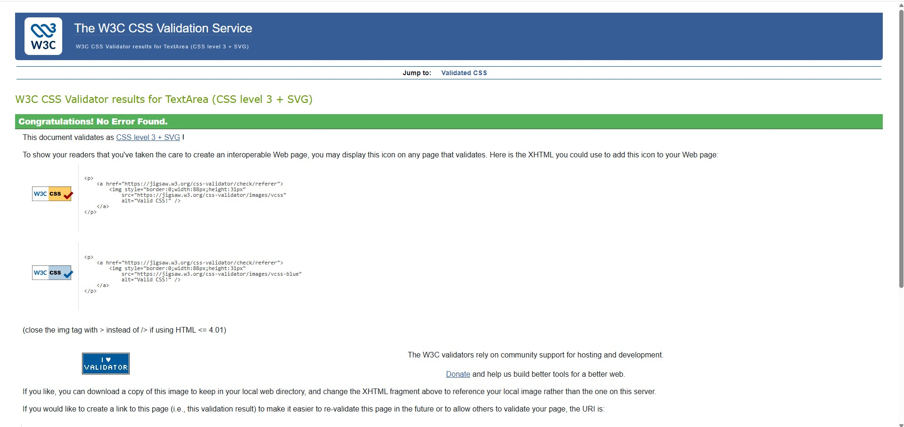 | ⚠️ Notes (if applicable) |

### JavaScript

I have used the recommended [JShint Validator](https://jshint.com) to validate all of my JS files.

| Directory | File | URL | Screenshot | Notes |
| --- | --- | --- | --- | --- |
| checkout/static/checkout/js | [stripe_elements.js](https://github.com/colmwoods/PCPartsIreland/blob/main/checkout/static/checkout/js/stripe_elements.js) | ⚠️ Link (if applicable) | 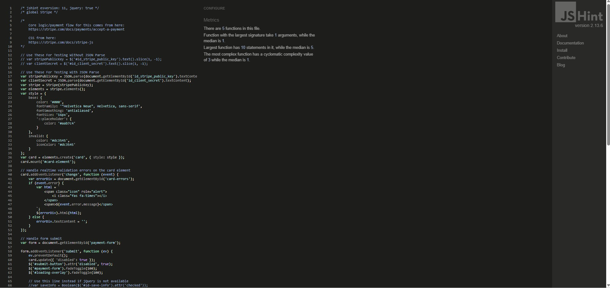 | ⚠️ Notes (if applicable) |

### Python

I have used the recommended [PEP8 CI Python Linter](https://pep8ci.herokuapp.com) to validate all of my Python files.

| Directory | File | URL | Screenshot | Notes |
| --- | --- | --- | --- | --- |

|  | [custom_storages.py](https://github.com/colmwoods/PCPartsIreland/blob/main/custom_storages.py) | [PEP8 CI Link](https://pep8ci.herokuapp.com/https://raw.githubusercontent.com/colmwoods/PCPartsIreland/main/custom_storages.py) | 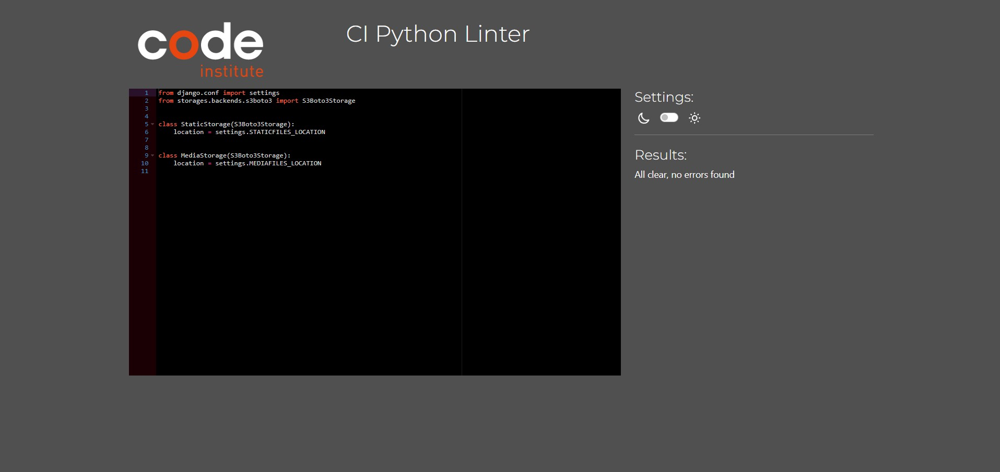 | ⚠️ Notes (if applicable) |
|  | [manage.py](https://github.com/colmwoods/PCPartsIreland/blob/main/manage.py) | [PEP8 CI Link](https://pep8ci.herokuapp.com/https://raw.githubusercontent.com/colmwoods/PCPartsIreland/main/manage.py) | 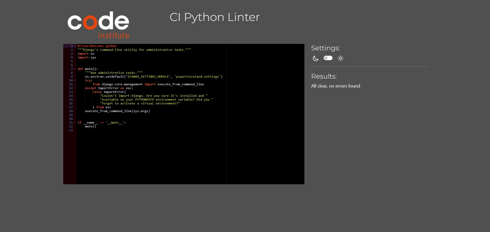 | ⚠️ Notes (if applicable) |
| bag | [admin.py](https://github.com/colmwoods/PCPartsIreland/blob/main/bag/admin.py) | [PEP8 CI Link](https://pep8ci.herokuapp.com/https://raw.githubusercontent.com/colmwoods/PCPartsIreland/main/bag/admin.py) | 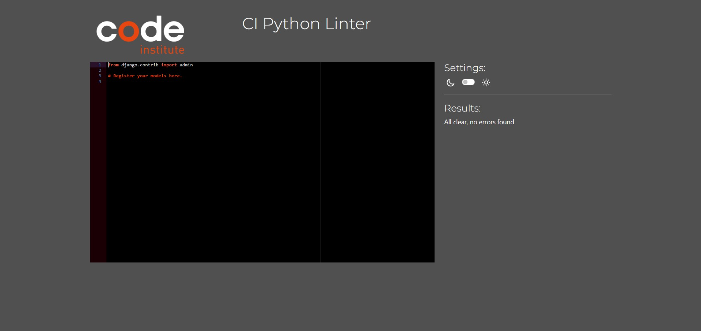 | ⚠️ Notes (if applicable) |
| bag | [apps.py](https://github.com/colmwoods/PCPartsIreland/blob/main/bag/apps.py) | [PEP8 CI Link](https://pep8ci.herokuapp.com/https://raw.githubusercontent.com/colmwoods/PCPartsIreland/main/bag/apps.py) |  | ⚠️ Notes (if applicable) |
| bag | [context.py](https://github.com/colmwoods/PCPartsIreland/blob/main/bag/context.py) | [PEP8 CI Link](https://pep8ci.herokuapp.com/https://raw.githubusercontent.com/colmwoods/PCPartsIreland/main/bag/context.py) | 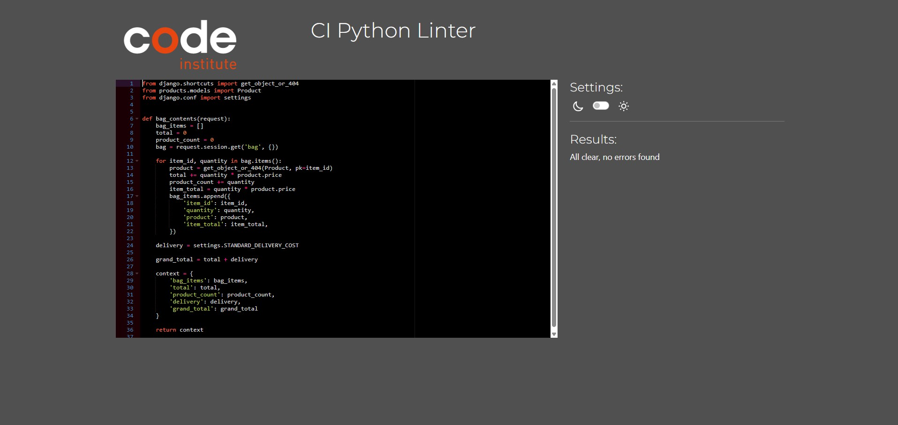 | ⚠️ Notes (if applicable) |
| bag | [models.py](https://github.com/colmwoods/PCPartsIreland/blob/main/bag/models.py) | [PEP8 CI Link](https://pep8ci.herokuapp.com/https://raw.githubusercontent.com/colmwoods/PCPartsIreland/main/bag/models.py) |  | ⚠️ Notes (if applicable) |
| bag | [tests.py](https://github.com/colmwoods/PCPartsIreland/blob/main/bag/tests.py) | [PEP8 CI Link](https://pep8ci.herokuapp.com/https://raw.githubusercontent.com/colmwoods/PCPartsIreland/main/bag/tests.py) | 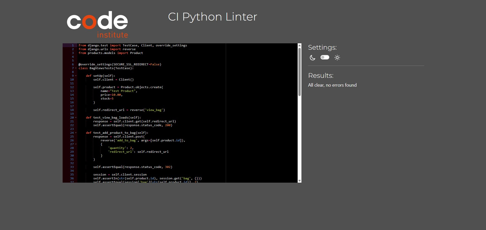 | ⚠️ Notes (if applicable) |
| bag | [urls.py](https://github.com/colmwoods/PCPartsIreland/blob/main/bag/urls.py) | [PEP8 CI Link](https://pep8ci.herokuapp.com/https://raw.githubusercontent.com/colmwoods/PCPartsIreland/main/bag/urls.py) | 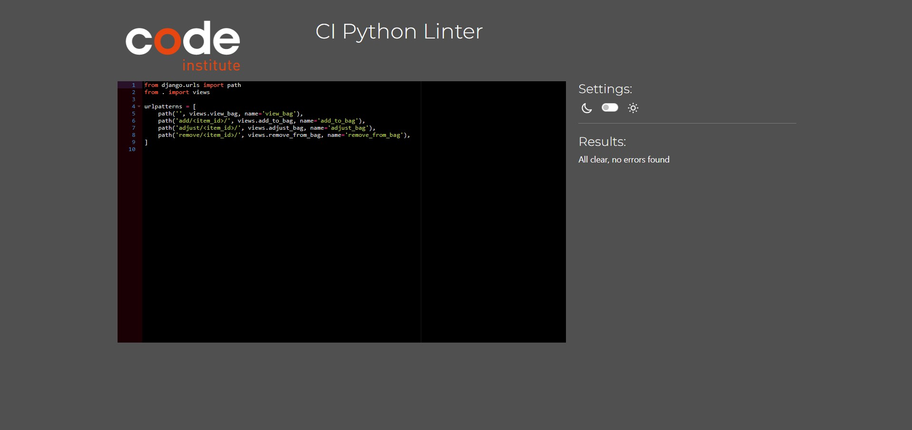 | ⚠️ Notes (if applicable) |
| bag | [views.py](https://github.com/colmwoods/PCPartsIreland/blob/main/bag/views.py) | [PEP8 CI Link](https://pep8ci.herokuapp.com/https://raw.githubusercontent.com/colmwoods/PCPartsIreland/main/bag/views.py) | 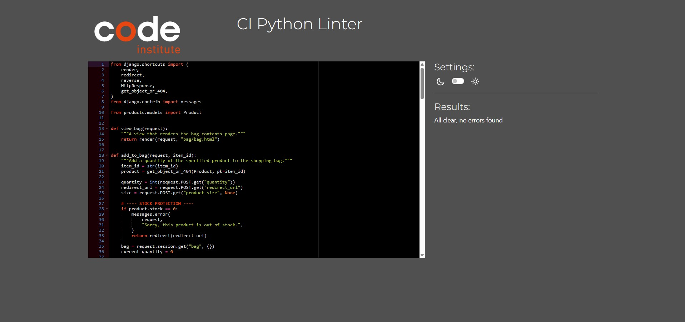 | ⚠️ Notes (if applicable) |
| checkout | [admin.py](https://github.com/colmwoods/PCPartsIreland/blob/main/checkout/admin.py) | [PEP8 CI Link](https://pep8ci.herokuapp.com/https://raw.githubusercontent.com/colmwoods/PCPartsIreland/main/checkout/admin.py) | 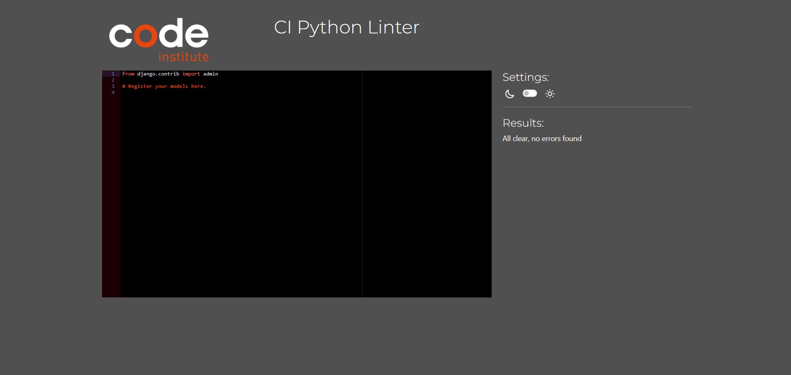 | ⚠️ Notes (if applicable) |
| checkout | [apps.py](https://github.com/colmwoods/PCPartsIreland/blob/main/checkout/apps.py) | [PEP8 CI Link](https://pep8ci.herokuapp.com/https://raw.githubusercontent.com/colmwoods/PCPartsIreland/main/checkout/apps.py) |  | ⚠️ Notes (if applicable) |
| checkout | [forms.py](https://github.com/colmwoods/PCPartsIreland/blob/main/checkout/forms.py) | [PEP8 CI Link](https://pep8ci.herokuapp.com/https://raw.githubusercontent.com/colmwoods/PCPartsIreland/main/checkout/forms.py) | 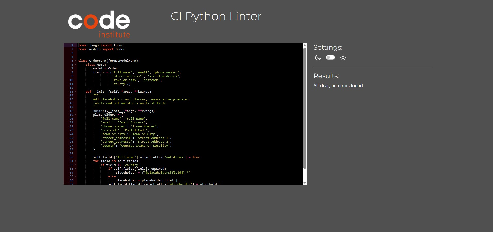 | ⚠️ Notes (if applicable) |
| checkout | [models.py](https://github.com/colmwoods/PCPartsIreland/blob/main/checkout/models.py) | [PEP8 CI Link](https://pep8ci.herokuapp.com/https://raw.githubusercontent.com/colmwoods/PCPartsIreland/main/checkout/models.py) | 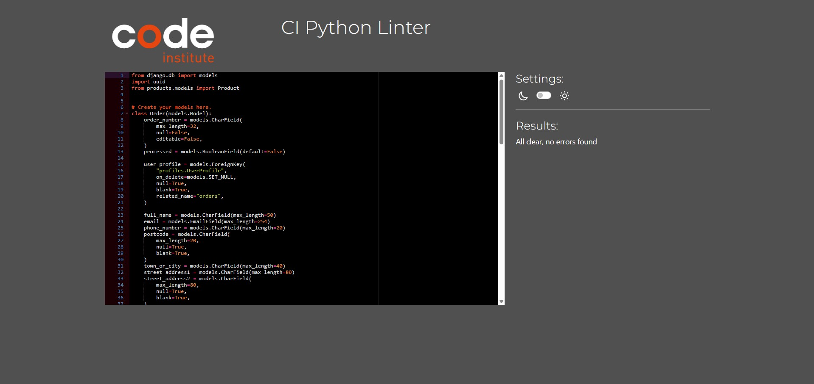 | ⚠️ Notes (if applicable) |
| checkout | [tests.py](https://github.com/colmwoods/PCPartsIreland/blob/main/checkout/tests.py) | [PEP8 CI Link](https://pep8ci.herokuapp.com/https://raw.githubusercontent.com/colmwoods/PCPartsIreland/main/checkout/tests.py) | 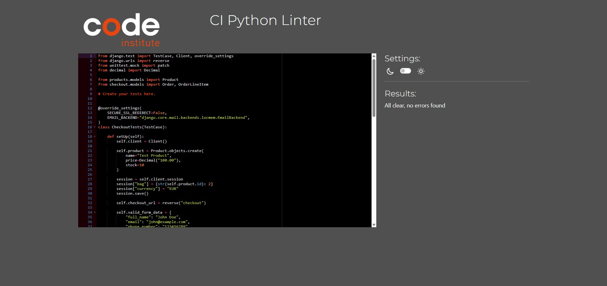 | ⚠️ Notes (if applicable) |
| checkout | [urls.py](https://github.com/colmwoods/PCPartsIreland/blob/main/checkout/urls.py) | [PEP8 CI Link](https://pep8ci.herokuapp.com/https://raw.githubusercontent.com/colmwoods/PCPartsIreland/main/checkout/urls.py) | 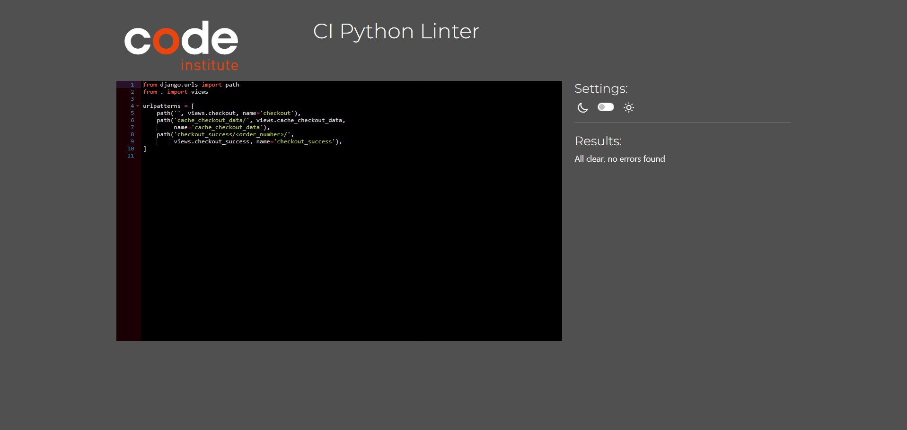 | ⚠️ Notes (if applicable) |
| checkout | [views.py](https://github.com/colmwoods/PCPartsIreland/blob/main/checkout/views.py) | [PEP8 CI Link](https://pep8ci.herokuapp.com/https://raw.githubusercontent.com/colmwoods/PCPartsIreland/main/checkout/views.py) | 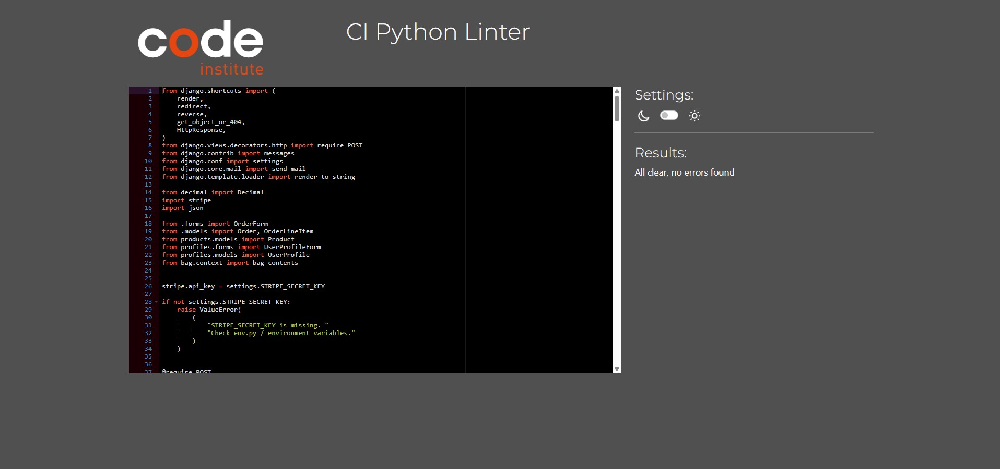 | ⚠️ Notes (if applicable) |
| faq | [admin.py](https://github.com/colmwoods/PCPartsIreland/blob/main/faq/admin.py) | [PEP8 CI Link](https://pep8ci.herokuapp.com/https://raw.githubusercontent.com/colmwoods/PCPartsIreland/main/faq/admin.py) | 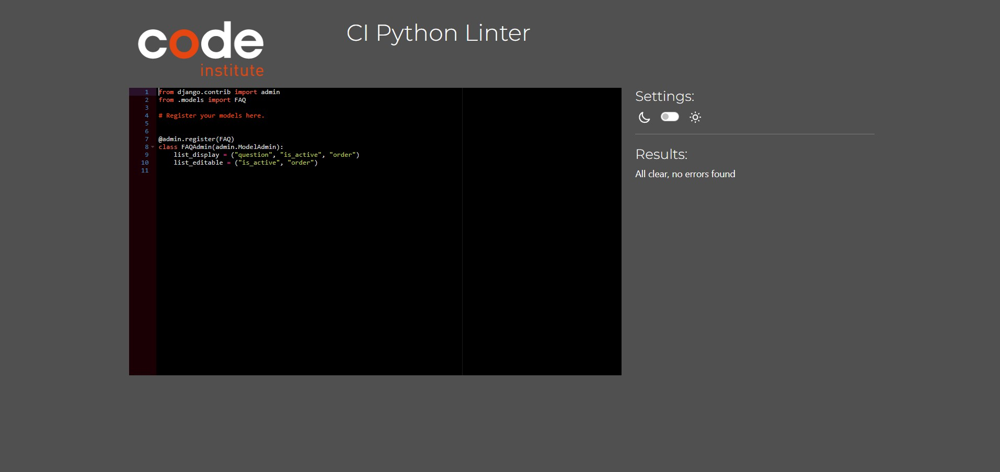 | ⚠️ Notes (if applicable) |
| faq | [apps.py](https://github.com/colmwoods/PCPartsIreland/blob/main/faq/apps.py) | [PEP8 CI Link](https://pep8ci.herokuapp.com/https://raw.githubusercontent.com/colmwoods/PCPartsIreland/main/faq/apps.py) | 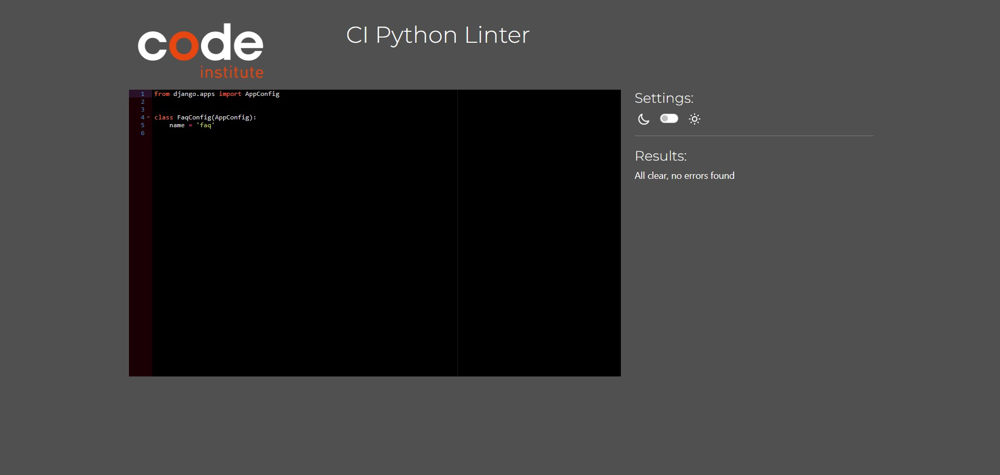 | ⚠️ Notes (if applicable) |
| faq | [models.py](https://github.com/colmwoods/PCPartsIreland/blob/main/faq/models.py) | [PEP8 CI Link](https://pep8ci.herokuapp.com/https://raw.githubusercontent.com/colmwoods/PCPartsIreland/main/faq/models.py) | 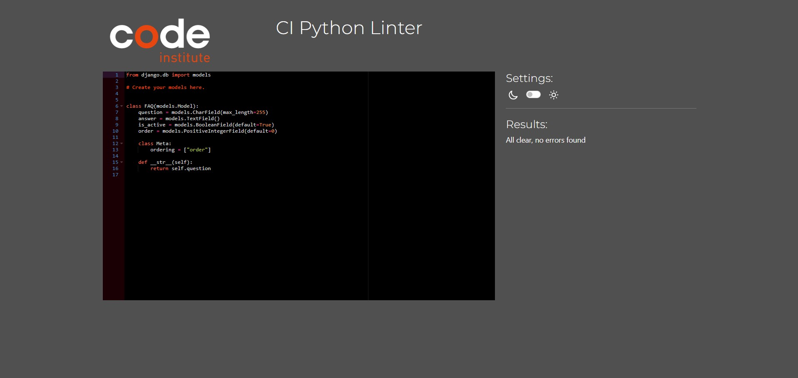 | ⚠️ Notes (if applicable) |
| faq | [tests.py](https://github.com/colmwoods/PCPartsIreland/blob/main/faq/tests.py) | [PEP8 CI Link](https://pep8ci.herokuapp.com/https://raw.githubusercontent.com/colmwoods/PCPartsIreland/main/faq/tests.py) | 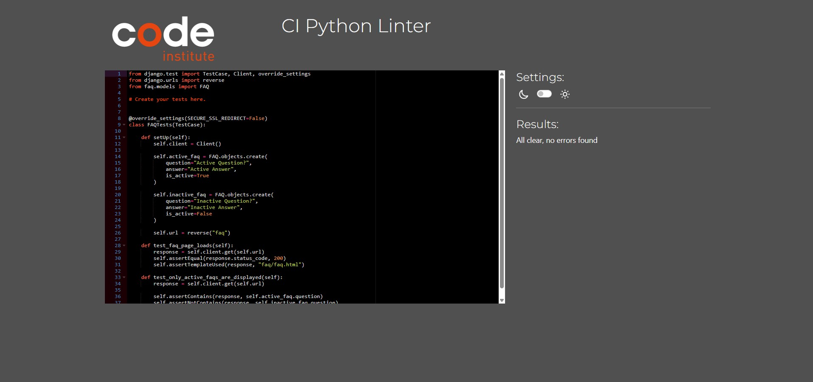 | ⚠️ Notes (if applicable) |
| faq | [urls.py](https://github.com/colmwoods/PCPartsIreland/blob/main/faq/urls.py) | [PEP8 CI Link](https://pep8ci.herokuapp.com/https://raw.githubusercontent.com/colmwoods/PCPartsIreland/main/faq/urls.py) |  | ⚠️ Notes (if applicable) |
| faq | [views.py](https://github.com/colmwoods/PCPartsIreland/blob/main/faq/views.py) | [PEP8 CI Link](https://pep8ci.herokuapp.com/https://raw.githubusercontent.com/colmwoods/PCPartsIreland/main/faq/views.py) | 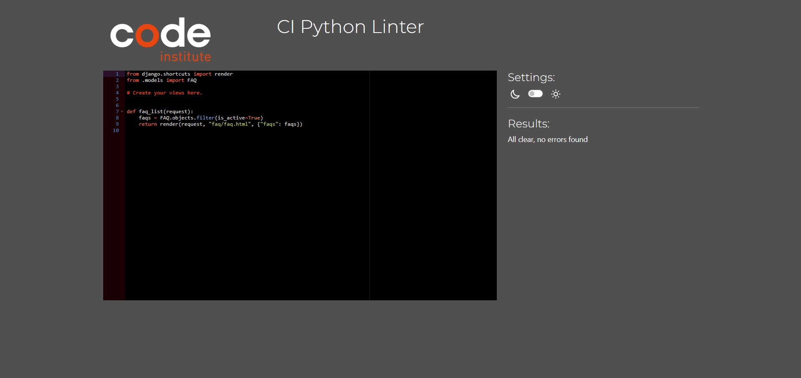 | ⚠️ Notes (if applicable) |
| form | [admin.py](https://github.com/colmwoods/PCPartsIreland/blob/main/form/admin.py) | [PEP8 CI Link](https://pep8ci.herokuapp.com/https://raw.githubusercontent.com/colmwoods/PCPartsIreland/main/form/admin.py) | 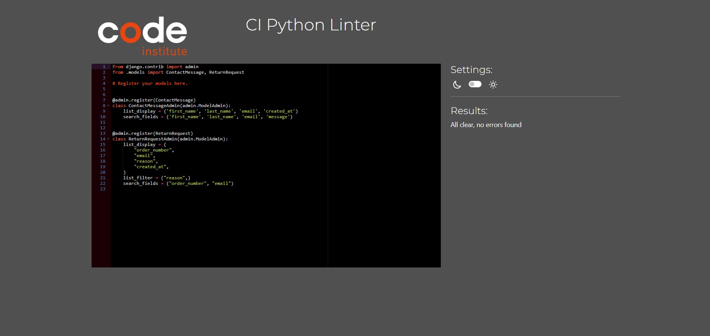 | ⚠️ Notes (if applicable) |
| form | [apps.py](https://github.com/colmwoods/PCPartsIreland/blob/main/form/apps.py) | [PEP8 CI Link](https://pep8ci.herokuapp.com/https://raw.githubusercontent.com/colmwoods/PCPartsIreland/main/form/apps.py) |  | ⚠️ Notes (if applicable) |
| form | [forms.py](https://github.com/colmwoods/PCPartsIreland/blob/main/form/forms.py) | [PEP8 CI Link](https://pep8ci.herokuapp.com/https://raw.githubusercontent.com/colmwoods/PCPartsIreland/main/form/forms.py) | 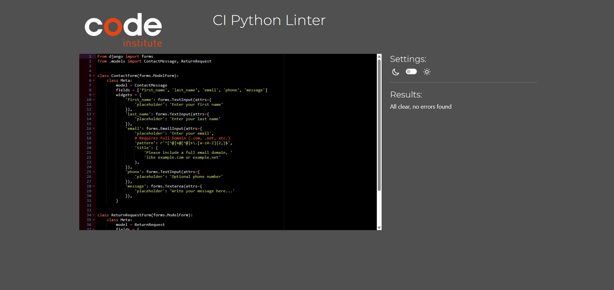 | ⚠️ Notes (if applicable) |
| form | [models.py](https://github.com/colmwoods/PCPartsIreland/blob/main/form/models.py) | [PEP8 CI Link](https://pep8ci.herokuapp.com/https://raw.githubusercontent.com/colmwoods/PCPartsIreland/main/form/models.py) | 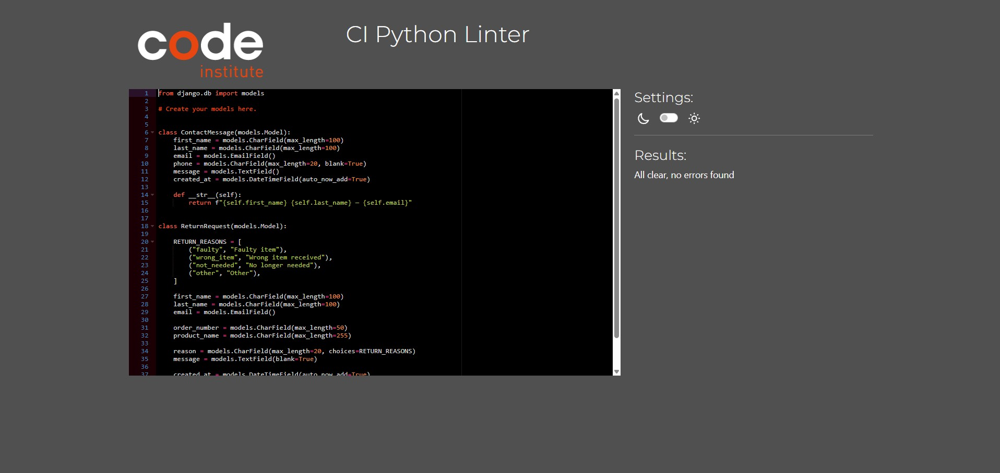 | ⚠️ Notes (if applicable) |
| form | [tests.py](https://github.com/colmwoods/PCPartsIreland/blob/main/form/tests.py) | [PEP8 CI Link](https://pep8ci.herokuapp.com/https://raw.githubusercontent.com/colmwoods/PCPartsIreland/main/form/tests.py) | 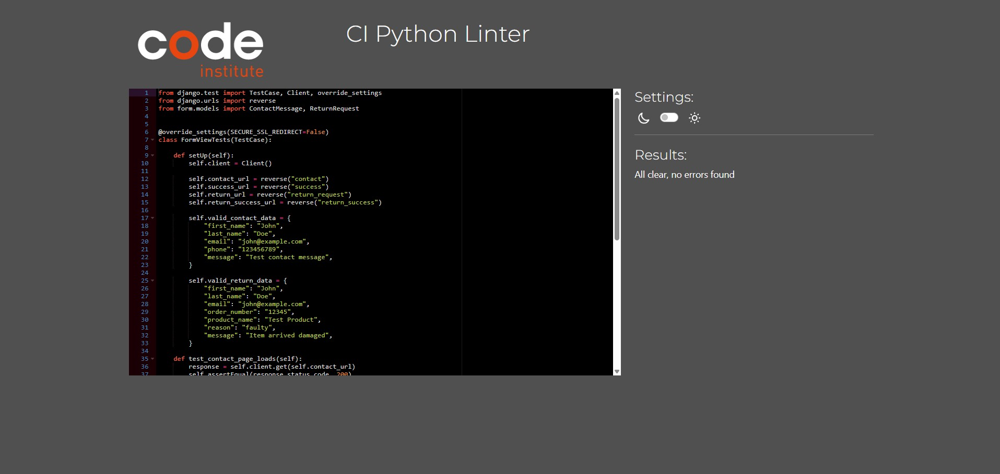 | ⚠️ Notes (if applicable) |
| form | [urls.py](https://github.com/colmwoods/PCPartsIreland/blob/main/form/urls.py) | [PEP8 CI Link](https://pep8ci.herokuapp.com/https://raw.githubusercontent.com/colmwoods/PCPartsIreland/main/form/urls.py) | 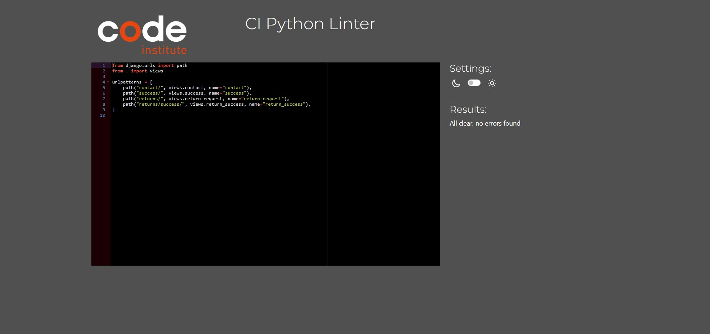 | ⚠️ Notes (if applicable) |
| form | [views.py](https://github.com/colmwoods/PCPartsIreland/blob/main/form/views.py) | [PEP8 CI Link](https://pep8ci.herokuapp.com/https://raw.githubusercontent.com/colmwoods/PCPartsIreland/main/form/views.py) | 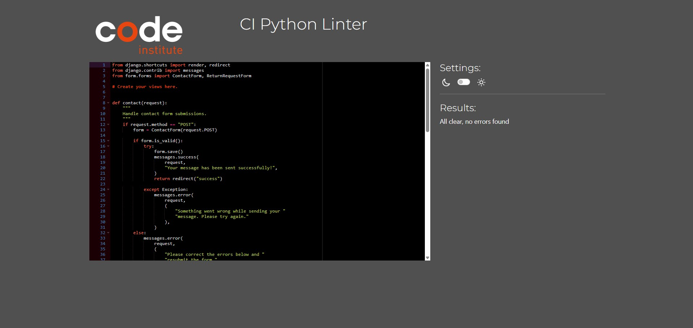 | ⚠️ Notes (if applicable) |
| home | [admin.py](https://github.com/colmwoods/PCPartsIreland/blob/main/home/admin.py) | [PEP8 CI Link](https://pep8ci.herokuapp.com/https://raw.githubusercontent.com/colmwoods/PCPartsIreland/main/home/admin.py) |  | ⚠️ Notes (if applicable) |
| home | [apps.py](https://github.com/colmwoods/PCPartsIreland/blob/main/home/apps.py) | [PEP8 CI Link](https://pep8ci.herokuapp.com/https://raw.githubusercontent.com/colmwoods/PCPartsIreland/main/home/apps.py) |  | ⚠️ Notes (if applicable) |
| home | [models.py](https://github.com/colmwoods/PCPartsIreland/blob/main/home/models.py) | [PEP8 CI Link](https://pep8ci.herokuapp.com/https://raw.githubusercontent.com/colmwoods/PCPartsIreland/main/home/models.py) |  | ⚠️ Notes (if applicable) |
| home | [tests.py](https://github.com/colmwoods/PCPartsIreland/blob/main/home/tests.py) | [PEP8 CI Link](https://pep8ci.herokuapp.com/https://raw.githubusercontent.com/colmwoods/PCPartsIreland/main/home/tests.py) | 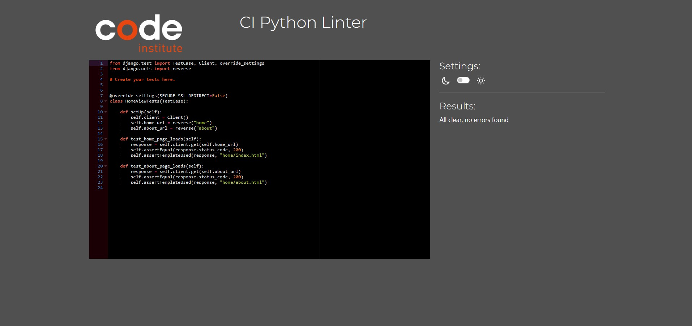 | ⚠️ Notes (if applicable) |
| home | [urls.py](https://github.com/colmwoods/PCPartsIreland/blob/main/home/urls.py) | [PEP8 CI Link](https://pep8ci.herokuapp.com/https://raw.githubusercontent.com/colmwoods/PCPartsIreland/main/home/urls.py) | 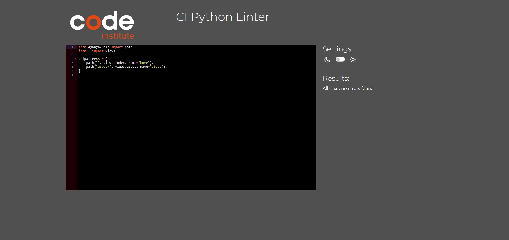 | ⚠️ Notes (if applicable) |
| home | [views.py](https://github.com/colmwoods/PCPartsIreland/blob/main/home/views.py) | [PEP8 CI Link](https://pep8ci.herokuapp.com/https://raw.githubusercontent.com/colmwoods/PCPartsIreland/main/home/views.py) | 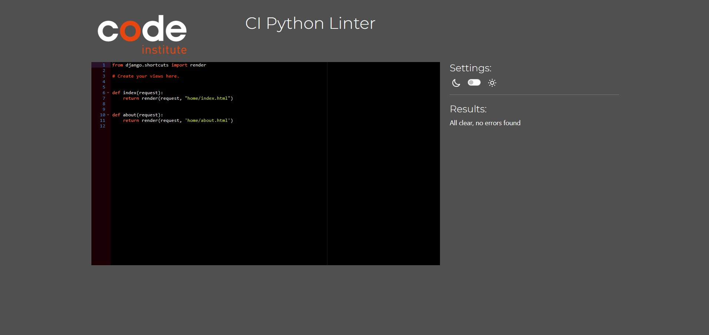 | ⚠️ Notes (if applicable) |
| pcpartsireland | [asgi.py](https://github.com/colmwoods/PCPartsIreland/blob/main/pcpartsireland/asgi.py) | [PEP8 CI Link](https://pep8ci.herokuapp.com/https://raw.githubusercontent.com/colmwoods/PCPartsIreland/main/pcpartsireland/asgi.py) | 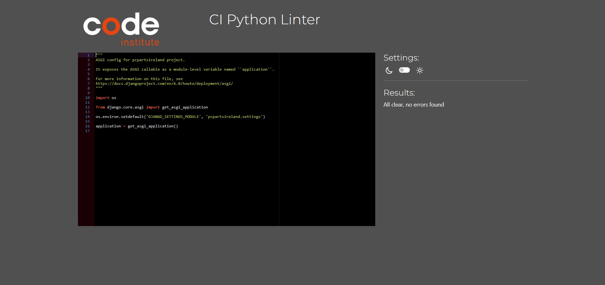 | ⚠️ Notes (if applicable) |
| pcpartsireland | [context_processors.py](https://github.com/colmwoods/PCPartsIreland/blob/main/pcpartsireland/context_processors.py) | [PEP8 CI Link](https://pep8ci.herokuapp.com/https://raw.githubusercontent.com/colmwoods/PCPartsIreland/main/pcpartsireland/context_processors.py) | 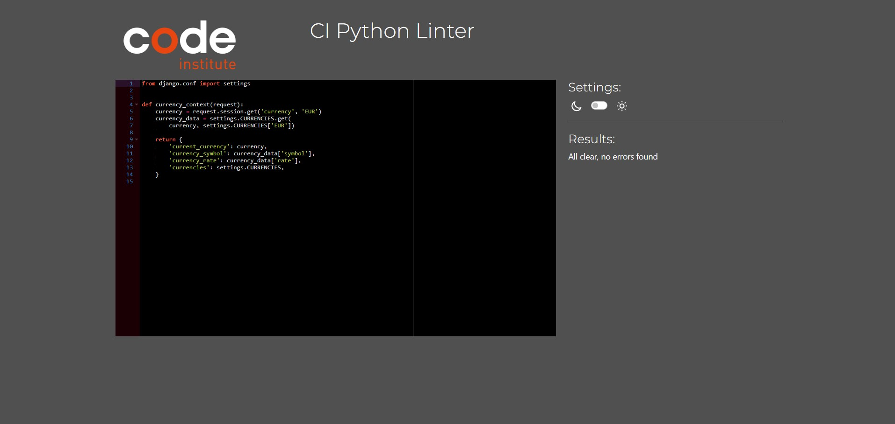 | ⚠️ Notes (if applicable) |
| pcpartsireland | [middleware.py](https://github.com/colmwoods/PCPartsIreland/blob/main/pcpartsireland/middleware.py) | [PEP8 CI Link](https://pep8ci.herokuapp.com/https://raw.githubusercontent.com/colmwoods/PCPartsIreland/main/pcpartsireland/middleware.py) | 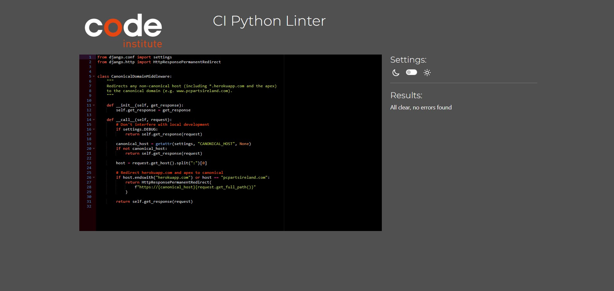 | ⚠️ Notes (if applicable) |
| pcpartsireland | [settings.py](https://github.com/colmwoods/PCPartsIreland/blob/main/pcpartsireland/settings.py) | [PEP8 CI Link](https://pep8ci.herokuapp.com/https://raw.githubusercontent.com/colmwoods/PCPartsIreland/main/pcpartsireland/settings.py) | 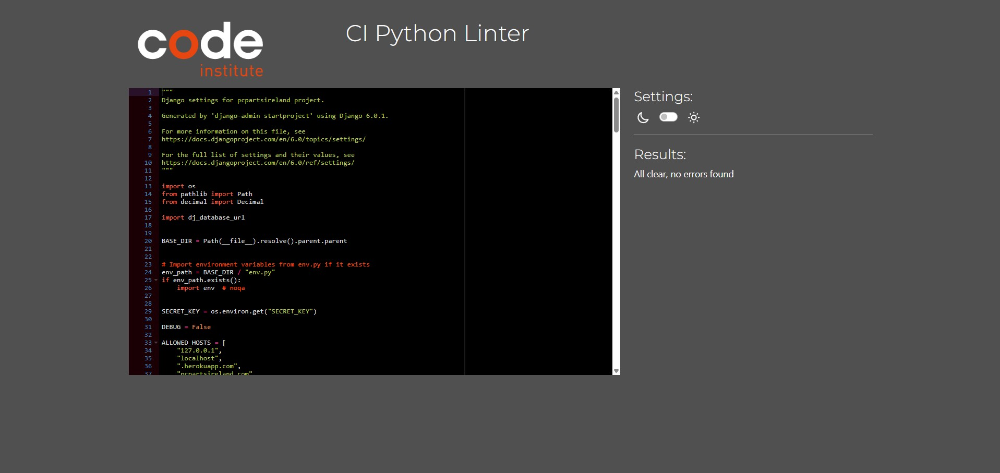 | ⚠️ Notes (if applicable) |
| pcpartsireland | [tests.py](https://github.com/colmwoods/PCPartsIreland/blob/main/pcpartsireland/tests.py) | [PEP8 CI Link](https://pep8ci.herokuapp.com/https://raw.githubusercontent.com/colmwoods/PCPartsIreland/main/pcpartsireland/tests.py) | 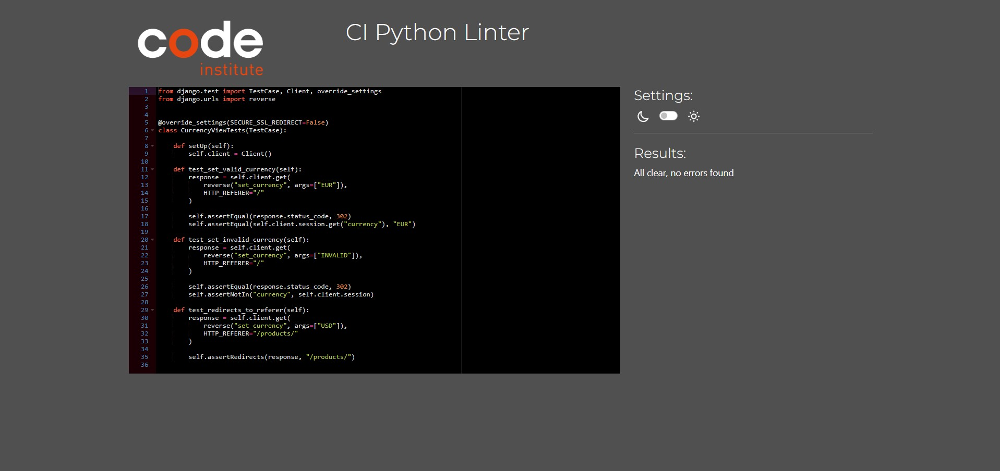 | ⚠️ Notes (if applicable) |
| pcpartsireland | [urls.py](https://github.com/colmwoods/PCPartsIreland/blob/main/pcpartsireland/urls.py) | [PEP8 CI Link](https://pep8ci.herokuapp.com/https://raw.githubusercontent.com/colmwoods/PCPartsIreland/main/pcpartsireland/urls.py) | 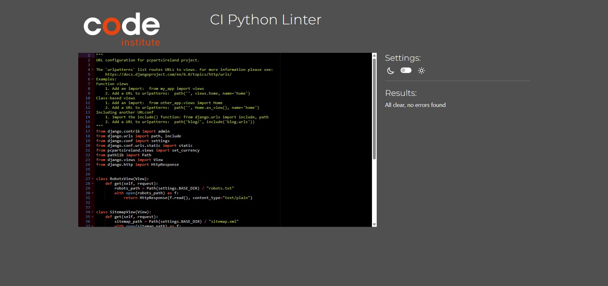 | ⚠️ Notes (if applicable) |
| pcpartsireland | [views.py](https://github.com/colmwoods/PCPartsIreland/blob/main/pcpartsireland/views.py) | [PEP8 CI Link](https://pep8ci.herokuapp.com/https://raw.githubusercontent.com/colmwoods/PCPartsIreland/main/pcpartsireland/views.py) | 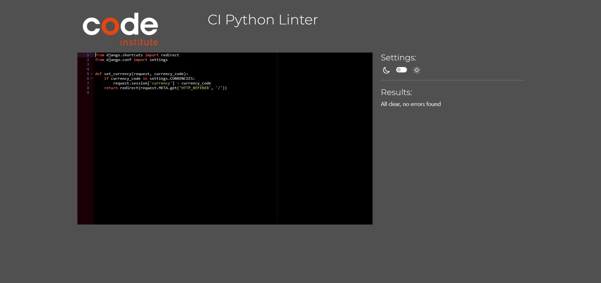 | ⚠️ Notes (if applicable) |
| pcpartsireland | [wsgi.py](https://github.com/colmwoods/PCPartsIreland/blob/main/pcpartsireland/wsgi.py) | [PEP8 CI Link](https://pep8ci.herokuapp.com/https://raw.githubusercontent.com/colmwoods/PCPartsIreland/main/pcpartsireland/wsgi.py) | 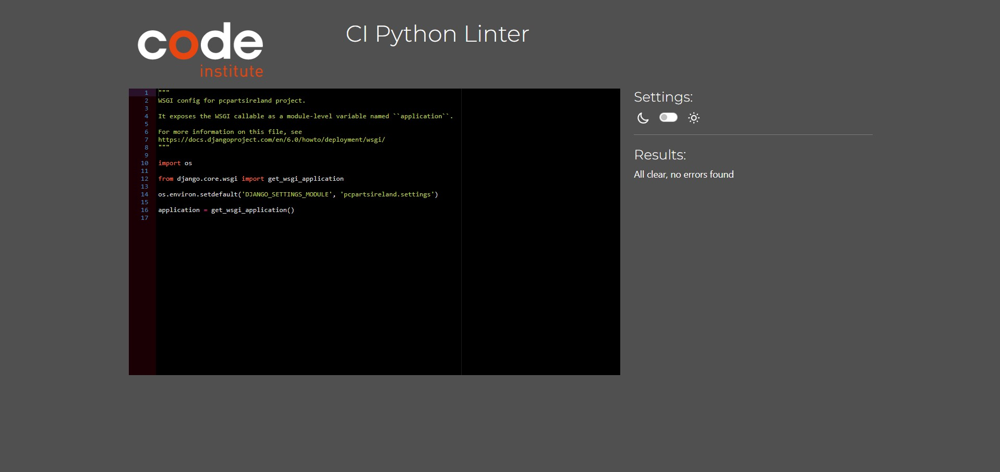 | ⚠️ Notes (if applicable) |
| products | [admin.py](https://github.com/colmwoods/PCPartsIreland/blob/main/products/admin.py) | [PEP8 CI Link](https://pep8ci.herokuapp.com/https://raw.githubusercontent.com/colmwoods/PCPartsIreland/main/products/admin.py) | 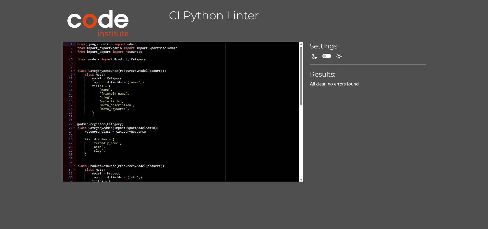 | ⚠️ Notes (if applicable) |
| products | [apps.py](https://github.com/colmwoods/PCPartsIreland/blob/main/products/apps.py) | [PEP8 CI Link](https://pep8ci.herokuapp.com/https://raw.githubusercontent.com/colmwoods/PCPartsIreland/main/products/apps.py) | 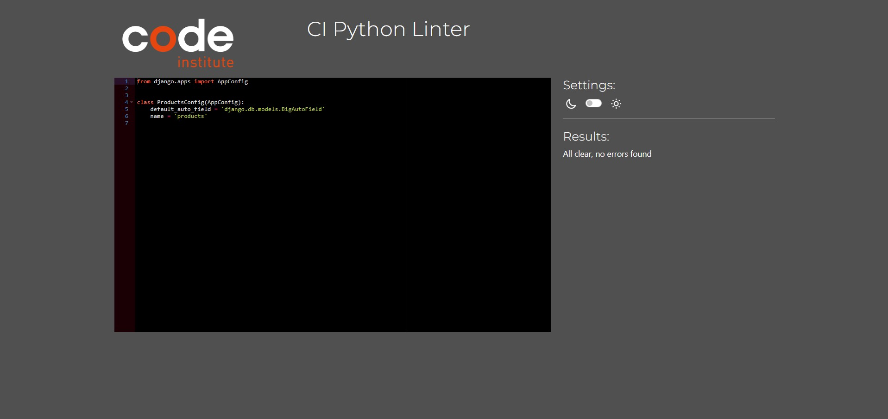 | ⚠️ Notes (if applicable) |
| products | [forms.py](https://github.com/colmwoods/PCPartsIreland/blob/main/products/forms.py) | [PEP8 CI Link](https://pep8ci.herokuapp.com/https://raw.githubusercontent.com/colmwoods/PCPartsIreland/main/products/forms.py) | 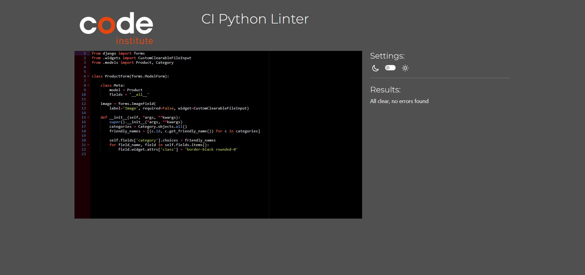 | ⚠️ Notes (if applicable) |
| products | [models.py](https://github.com/colmwoods/PCPartsIreland/blob/main/products/models.py) | [PEP8 CI Link](https://pep8ci.herokuapp.com/https://raw.githubusercontent.com/colmwoods/PCPartsIreland/main/products/models.py) | 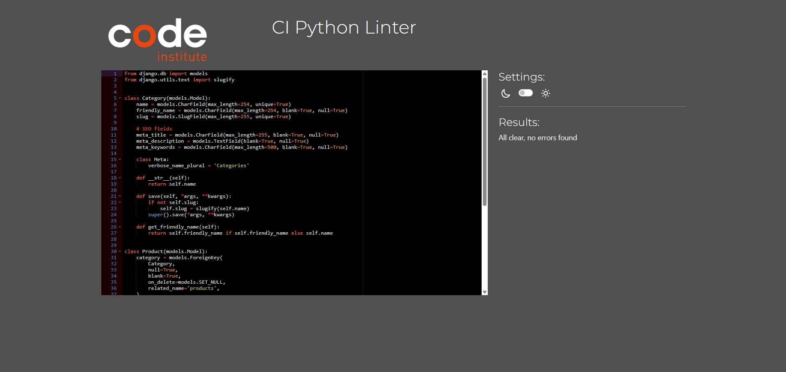 | ⚠️ Notes (if applicable) |
| products | [tests.py](https://github.com/colmwoods/PCPartsIreland/blob/main/products/tests.py) | [PEP8 CI Link](https://pep8ci.herokuapp.com/https://raw.githubusercontent.com/colmwoods/PCPartsIreland/main/products/tests.py) | 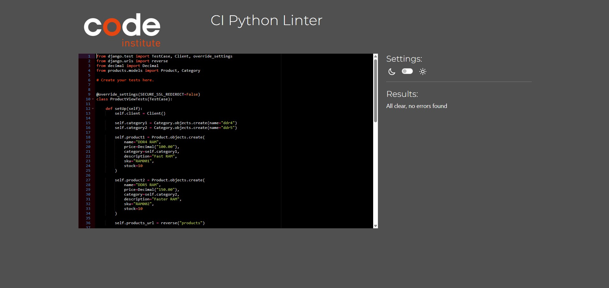 | ⚠️ Notes (if applicable) |
| products | [urls.py](https://github.com/colmwoods/PCPartsIreland/blob/main/products/urls.py) | [PEP8 CI Link](https://pep8ci.herokuapp.com/https://raw.githubusercontent.com/colmwoods/PCPartsIreland/main/products/urls.py) |  | ⚠️ Notes (if applicable) |
| products | [views.py](https://github.com/colmwoods/PCPartsIreland/blob/main/products/views.py) | [PEP8 CI Link](https://pep8ci.herokuapp.com/https://raw.githubusercontent.com/colmwoods/PCPartsIreland/main/products/views.py) | 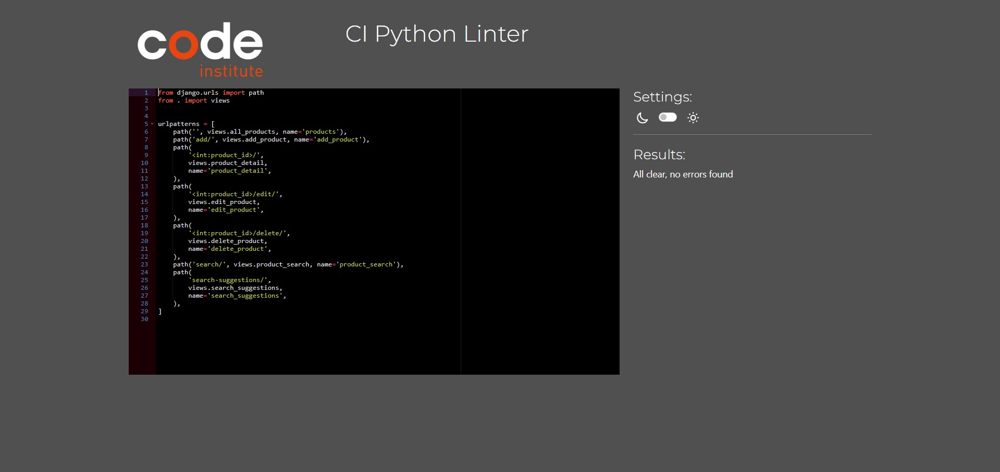 | ⚠️ Notes (if applicable) |
| products | [widgets.py](https://github.com/colmwoods/PCPartsIreland/blob/main/products/widgets.py) | [PEP8 CI Link](https://pep8ci.herokuapp.com/https://raw.githubusercontent.com/colmwoods/PCPartsIreland/main/products/widgets.py) | 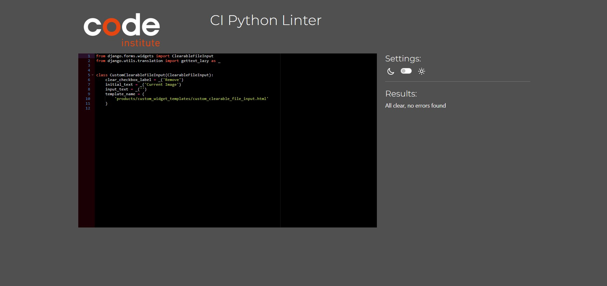 | ⚠️ Notes (if applicable) |
| products | [math_filters.py](https://github.com/colmwoods/PCPartsIreland/blob/main/products/templatetags/math_filters.py) | [PEP8 CI Link](https://pep8ci.herokuapp.com/https://raw.githubusercontent.com/colmwoods/PCPartsIreland/main/products/templatetags/math_filters.py) | 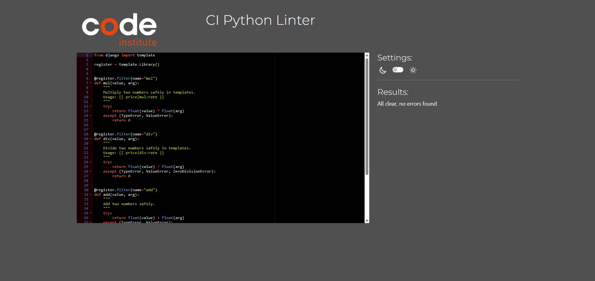 | ⚠️ Notes (if applicable) |
| profiles | [admin.py](https://github.com/colmwoods/PCPartsIreland/blob/main/profiles/admin.py) | [PEP8 CI Link](https://pep8ci.herokuapp.com/https://raw.githubusercontent.com/colmwoods/PCPartsIreland/main/profiles/admin.py) |  | ⚠️ Notes (if applicable) |
| profiles | [apps.py](https://github.com/colmwoods/PCPartsIreland/blob/main/profiles/apps.py) | [PEP8 CI Link](https://pep8ci.herokuapp.com/https://raw.githubusercontent.com/colmwoods/PCPartsIreland/main/profiles/apps.py) | 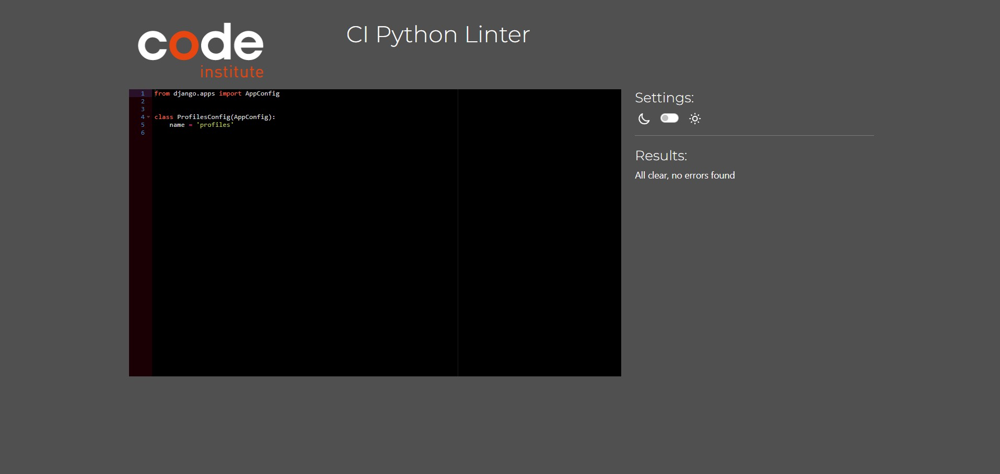 | ⚠️ Notes (if applicable) |
| profiles | [forms.py](https://github.com/colmwoods/PCPartsIreland/blob/main/profiles/forms.py) | [PEP8 CI Link](https://pep8ci.herokuapp.com/https://raw.githubusercontent.com/colmwoods/PCPartsIreland/main/profiles/forms.py) | 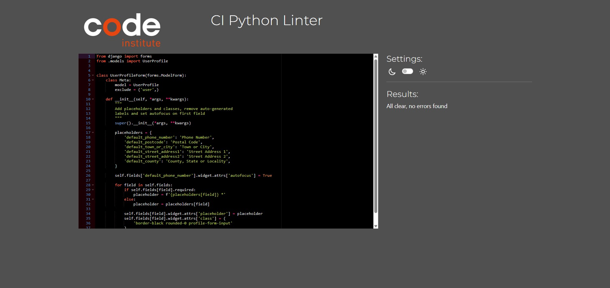 | ⚠️ Notes (if applicable) |
| profiles | [models.py](https://github.com/colmwoods/PCPartsIreland/blob/main/profiles/models.py) | [PEP8 CI Link](https://pep8ci.herokuapp.com/https://raw.githubusercontent.com/colmwoods/PCPartsIreland/main/profiles/models.py) | 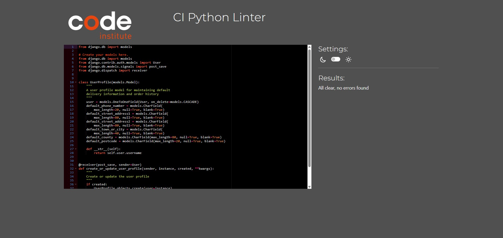 | ⚠️ Notes (if applicable) |
| profiles | [tests.py](https://github.com/colmwoods/PCPartsIreland/blob/main/profiles/tests.py) | [PEP8 CI Link](https://pep8ci.herokuapp.com/https://raw.githubusercontent.com/colmwoods/PCPartsIreland/main/profiles/tests.py) | 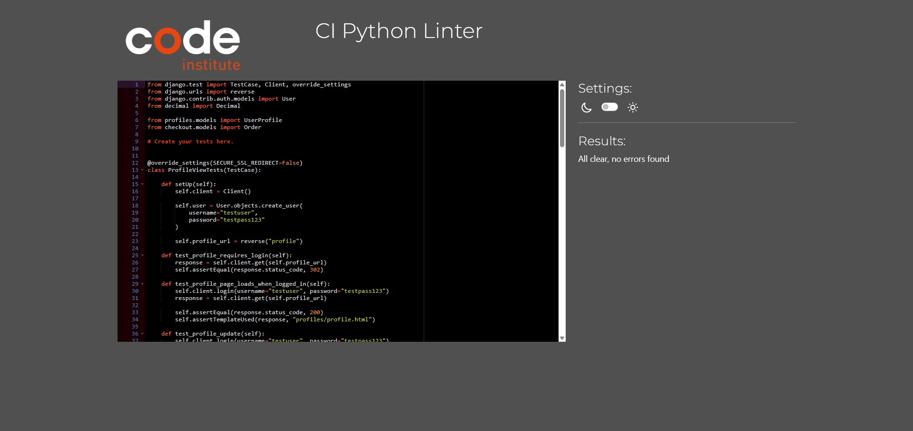 | ⚠️ Notes (if applicable) |
| profiles | [urls.py](https://github.com/colmwoods/PCPartsIreland/blob/main/profiles/urls.py) | [PEP8 CI Link](https://pep8ci.herokuapp.com/https://raw.githubusercontent.com/colmwoods/PCPartsIreland/main/profiles/urls.py) | 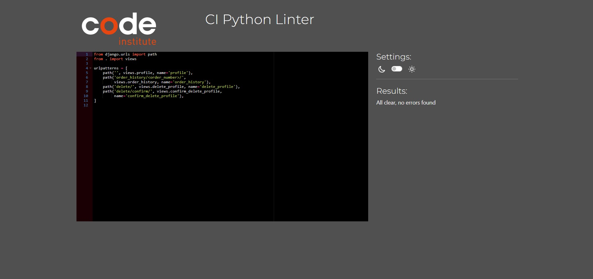 | ⚠️ Notes (if applicable) |
| profiles | [views.py](https://github.com/colmwoods/PCPartsIreland/blob/main/profiles/views.py) | [PEP8 CI Link](https://pep8ci.herokuapp.com/https://raw.githubusercontent.com/colmwoods/PCPartsIreland/main/profiles/views.py) |  | ⚠️ Notes (if applicable) |

## Responsiveness

I've tested my deployed project to check for responsiveness issues.

| Page | Mobile | Tablet | Desktop | Notes |
| --- | --- | --- | --- | --- |
| Register |  |  |  | Works as expected |
| Login |  |  |  | Works as expected |
| Profile |  |  |  | Works as expected |
| Home |  |  |  | Works as expected |
| Products |  |  |  | Works as expected |
| Product Details |  |  |  | Works as expected |
| Bag |  |  |  | Works as expected |
| Checkout |  |  |  | Works as expected |
| Checkout Success |  |  |  | Works as expected |
| Add Product |  |  |  | Works as expected |
| Edit Product |  |  |  | Works as expected |
| Newsletter |  |  |  | Works as expected |
| Contact |  |  |  | Works as expected |
| 404 |  |  |  | Works as expected |

## Browser Compatibility

I've tested my deployed project on multiple browsers to check for compatibility issues.

| Page | Chrome | Firefox | Safari | Notes |
| --- | --- | --- | --- | --- |
| Register |  |  |  | Works as expected |
| Login |  |  |  | Works as expected |
| Profile |  |  |  | Works as expected |
| Home |  |  |  | Works as expected |
| Products |  |  |  | Works as expected |
| Product Details |  |  |  | Works as expected |
| Bag |  |  |  | Works as expected |
| Checkout |  |  |  | Works as expected |
| Checkout Success |  |  |  | Works as expected |
| Add Product |  |  |  | Works as expected |
| Edit Product |  |  |  | Works as expected |
| Newsletter |  |  |  | Works as expected |
| Contact |  |  |  | Works as expected |
| 404 |  |  |  | Works as expected |

## Lighthouse Audit

I've tested my deployed project using the Lighthouse Audit tool to check for any major issues. Some warnings are outside of my control, and mobile results tend to be lower than desktop.

| Page | Mobile | Desktop |
| --- | --- | --- |
| Register |  |  |
| Login |  |  |
| Profile |  |  |
| Home |  |  |
| Products |  |  |
| Product Details |  |  |
| Bag |  |  |
| Checkout |  |  |
| Checkout Success |  |  |
| Add Product |  |  |
| Edit Product |  |  |
| Newsletter |  |  |
| Contact |  |  |
| 404 |  |  |

## Defensive Programming

Defensive programming was manually tested with the below user acceptance testing:

| Page | Expectation | Test | Result | Screenshot |
| --- | --- | --- | --- | --- |
| Products | Feature is expected to allow users to browse products without registration. | Opened product pages as a guest user. | Products were fully accessible without requiring registration. |  |
|  | Feature is expected to sort products by price and name. | Tested sorting options for price (low-to-high/high-to-low) and name (alphabetical). | Sorting worked correctly for all options. |  |
|  | Feature is expected to filter products by category. | Applied category filters while browsing products. | Filters worked as expected, displaying only relevant products. |  |
|  | Feature is expected to show detailed product information. | Clicked on individual products to view details. | Product details (description, price, image) were displayed correctly. |  |
| Shopping Cart | Feature is expected to allow customers to add items to the cart with quantity controls. | Added products to the cart and adjusted quantities. | Items were added successfully, and quantities updated as expected. |  |
|  | Feature is expected to allow customers to view and manage their cart. | Opened the cart page and edited cart contents. | Cart contents were displayed, updated, and removed correctly. |  |
| Checkout | Feature is expected to display cart items, grand total, and input fields for checkout. | Proceeded to checkout with items in the cart. | Checkout page displayed cart items, total, and input fields as expected. |  |
|  | Feature is expected to allow secure payment via Stripe. | Entered valid card details using Stripe at checkout. | Payment was processed securely, and an order confirmation page was displayed. |  |
|  | Feature is expected to send a confirmation email after purchase. | Completed a purchase and checked email inbox. | Confirmation email was received with order details. |  |
|  | Feature is expected to display an order confirmation page with an order number. | Completed a purchase. | Order confirmation page displayed successfully with an order number. |  |
| Account Management | Feature is expected to allow returning customers to log in and view past orders. | Logged in as a returning customer and accessed order history. | Past orders were displayed correctly in the account section. |  |
|  | Feature is expected to remember the shipping address for returning customers. | Completed multiple checkouts as a returning customer. | Shipping address was pre-filled on subsequent purchases. |  |
| Admin Features | Feature is expected to allow the site owner to create new products. | Created new products with valid data (name, price, description, image, category). | Products were added successfully and displayed on the site. |  |
|  | Feature is expected to allow the site owner to update product details. | Edited product details as an admin user. | Product updates were saved and displayed correctly. |  |
|  | Feature is expected to allow the site owner to delete products. | Deleted a product from the inventory. | Product was removed successfully from the site, after being prompted to confirm first. |  |
| Orders | Feature is expected to allow the site owner to view all orders placed. | Accessed the orders dashboard as an admin user. | All orders were displayed correctly. |  |
| Newsletter | Feature is expected to allow users to sign up for the newsletter. | Submitted valid email addresses for newsletter registration. | Email addresses were successfully added to the newsletter list. |  |
| 404 Error Page | Feature is expected to display a 404 error page for non-existent pages. | Navigated to an invalid URL (e.g., `/test`). | A custom 404 error page was displayed as expected. |  |

## User Story Testing

| Target | Expectation | Outcome | Screenshot |
| --- | --- | --- | --- |
| As a guest user | I would like to browse products without needing to register | so that I can shop freely before deciding to create an account. |  |
| As a guest user | I would like to be prompted to create an account or log in at checkout | so that I can complete my purchase and track my order history. |  |
| As a user | I would like to sign up to the site's newsletter | so that I can stay up to date with any upcoming sales or promotions. |  |
| As a customer | I would like to browse various product categories (clothing, toys, jewelry, kitchen gadgets, etc.) | so that I can easily find what I'm looking for. |  |
| As a customer | I would like to sort products by price (low-to-high/high-to-low) and name (alphabetical) | so that I can quickly organize items in a way that suits my shopping style. |  |
| As a customer | I would like to filter products by category | so that I can narrow down the products to the types I am most interested in. |  |
| As a customer | I would like to click on individual products to view more details (description, price, image, etc.) | so that I can make an informed decision about my purchase. |  |
| As a customer | I would like to add items to my shopping cart using quantity increment/decrement buttons | so that I can adjust how many units of a product I want before checkout. |  |
| As a customer | I would like to view and manage my shopping cart | so that I can review, add, or remove items before proceeding to checkout. |  |
| As a customer | I would like to adjust the quantity of items in my cart | so that I can modify my purchase preferences without leaving the cart. |  |
| As a customer | I would like to remove items from my cart | so that I can remove products I no longer wish to buy. |  |
| As a customer | I would like to proceed to checkout where I see my cart items, grand total, and input my name, email, shipping address, and card details | so that I can complete my purchase. |  |
| As a customer | I would like to receive a confirmation email after my purchase | so that I can have a record of my transaction and order details. |  |
| As a customer | I would like to see an order confirmation page with a checkout order number after completing my purchase | so that I know my order has been successfully placed. |  |
| As a customer | I would like to securely enter my card details using Stripe at checkout | so that I can feel confident my payment information is protected. |  |
| As a returning customer | I would like to be able to log in and view my past orders | so that I can track my previous purchases and order history. |  |
| As a returning customer | I would like the checkout process to remember my shipping address | so that future purchases are quicker and easier. |  |
| As a site owner | I would like to create new products with a name, description, price, images, and category | so that I can add additional items to the store inventory. |  |
| As a site owner | I would like to update product details (name, price, description, image, category) at any time | so that I can keep my product listings accurate and up to date. |  |
| As a site owner | I would like to delete products that are no longer available or relevant | so that I can maintain a clean and accurate inventory. |  |
| As a site owner | I would like to view all orders placed on the website | so that I can track and manage customer purchases. |  |
| As a site owner | I would like to manage product categories | so that I can ensure items are correctly organized and easy for customers to find. |  |
| As a user | I would like to see a 404 error page if I get lost | so that it's obvious that I've stumbled upon a page that doesn't exist. |  |

## Automated Testing

I have conducted a series of automated tests on my application.

> [!NOTE]  
> I fully acknowledge and understand that, in a real-world scenario, an extensive set of additional tests would be more comprehensive.

### Python (Unit Testing)

Below are the results from the full coverage report on my application that I've tested:


## Bugs

### Fixed Bugs

I've used [GitHub Issues](https://www.github.com/colmwoods/PCPartsIreland/issues) to track and manage bugs and issues during the development stages of my project.

All previously closed/fixed bugs can be tracked [here](https://www.github.com/colmwoods/PCPartsIreland/issues?q=is%3Aissue+is%3Aclosed+label%3Abug).


### Unfixed Bugs

Any remaining open issues can be tracked [here](https://www.github.com/colmwoods/PCPartsIreland/issues?q=is%3Aissue+is%3Aopen+label%3Abug).


### Known Issues

| Issue | Screenshot |
| --- | --- |
| The project is designed to be responsive from `375px` and upwards, in line with the material taught on the course LMS. Minor layout inconsistencies may occur on extra-wide (e.g. 4k/8k monitors), or smart-display devices (e.g. Nest Hub, Smart Watches, Gameboy Color, etc.), as these resolutions are outside the project’s scope. |  |
| When validating HTML with a semantic `<section>` element, the validator warns about lacking a header `h2-h6`. This is acceptable. |  |
| Validation errors on "signup.html" coming from the Django Allauth package. |  |
| With a known order-number, users can brute-force "checkout_success.html" and see potentially sensitive information. |  |
| If a product is in your bag/cart, but then gets deleted from the database, it throws errors from the session storage memory. |  |
| The `-`/`+` quantity buttons work well on "product_details.html", but not on "bag.html". |  |

> [!IMPORTANT]  
> There are no remaining bugs that I am aware of, though, even after thorough testing, I cannot rule out the possibility.